# BÁO CÁO ĐỒ ÁN

## HỆ THỐNG ĐẶT XE TRỰC TUYẾN GOMIRAI

### Kiến Trúc Microservices với Event-Driven Architecture

---

## MỤC LỤC

1. [Bài toán](#1-bài-toán)
2. [Phân tích chức năng của hệ thống](#2-phân-tích-chức-năng-của-hệ-thống)
3. [Phân tích và thiết kế dữ liệu](#3-phân-tích-và-thiết-kế-dữ-liệu-của-hệ-thống)
4. [Giao diện của hệ thống](#4-giao-diện-của-hệ-thống)
5. [Kết luận](#5-kết-luận)

---

## 1. BÀI TOÁN

### 1.1 Phát biểu bài toán

Trong bối cảnh đô thị hóa nhanh chóng và nhu cầu di chuyển ngày càng tăng, việc đặt xe trực tuyến đã trở thành một phần không thể thiếu trong cuộc sống hàng ngày. Các ứng dụng đặt xe như Grab, Gojek đã chứng minh hiệu quả của mô hình này. Tuy nhiên, việc xây dựng một hệ thống đặt xe đáp ứng được các yêu cầu về:

- **Khả năng mở rộng (Scalability)**: Hệ thống cần xử lý hàng nghìn yêu cầu đặt xe đồng thời
- **Độ tin cậy (Reliability)**: Đảm bảo dữ liệu nhất quán trong môi trường phân tán
- **Hiệu năng cao (High Performance)**: Phản hồi real-time cho việc theo dõi vị trí
- **Tính sẵn sàng (Availability)**: Hệ thống hoạt động liên tục 24/7

**GoMirai** là hệ thống đặt xe trực tuyến được xây dựng theo kiến trúc **Microservices** với **Event-Driven Architecture**, sử dụng **Saga Pattern** để đảm bảo tính nhất quán dữ liệu trong các giao dịch phân tán.

**Các vấn đề cần giải quyết:**

1. Kết nối khách hàng với tài xế gần nhất một cách nhanh chóng
2. Tính toán giá cước chính xác dựa trên khoảng cách và loại xe
3. Theo dõi vị trí real-time trong suốt chuyến đi
4. Quản lý thanh toán an toàn qua ví điện tử
5. Đảm bảo dữ liệu nhất quán khi một service gặp lỗi

---

## 2. PHÂN TÍCH CHỨC NĂNG CỦA HỆ THỐNG

### 2.1 Xác định mục tiêu của hệ thống

#### 2.1.1 Mục tiêu tổng quát

Xây dựng hệ thống đặt xe trực tuyến hoàn chỉnh với ba vai trò người dùng: **Khách hàng (Customer)**, **Tài xế (Driver)**, và **Quản trị viên (Admin)**.

#### 2.1.2 Yêu cầu chức năng

| STT | Chức năng          | Mô tả                                             |
| --- | ------------------ | ------------------------------------------------- |
| F1  | Đăng ký/Đăng nhập  | Xác thực người dùng qua số điện thoại và mật khẩu |
| F2  | Đặt xe             | Khách hàng đặt xe từ điểm đón đến điểm trả        |
| F3  | Tìm tài xế         | Hệ thống tự động tìm tài xế gần nhất              |
| F4  | Theo dõi real-time | Theo dõi vị trí tài xế trong suốt chuyến đi       |
| F5  | Thanh toán         | Thanh toán qua ví điện tử hoặc tiền mặt           |
| F6  | Đánh giá           | Khách hàng và tài xế đánh giá lẫn nhau            |
| F7  | Quản lý tài xế     | Admin duyệt đăng ký và quản lý tài xế             |
| F8  | Quản lý giá cước   | Admin cấu hình bảng giá theo loại xe              |
| F9  | Nạp tiền ví        | Khách hàng nạp tiền vào ví điện tử                |
| F10 | Thông báo          | Gửi thông báo real-time cho người dùng            |

#### 2.1.3 Yêu cầu phi chức năng

| STT | Yêu cầu          | Mô tả                            | Chỉ tiêu                   |
| --- | ---------------- | -------------------------------- | -------------------------- |
| NF1 | Khả năng mở rộng | Hệ thống có thể scale horizontal | Xử lý 10,000+ request/phút |
| NF2 | Độ tin cậy       | Đảm bảo dữ liệu nhất quán        | 99.9% uptime               |
| NF3 | Hiệu năng        | Phản hồi nhanh                   | Latency < 200ms            |
| NF4 | Bảo mật          | Xác thực JWT                     | Token-based authentication |
| NF5 | Real-time        | Cập nhật vị trí liên tục         | Mỗi 3-5 giây               |

---

### 2.2 Xây dựng biểu đồ chức năng

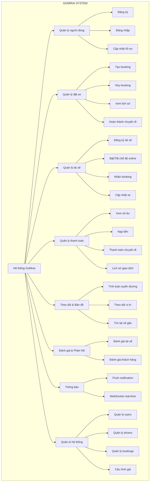
```mermaid
flowchart TD
    subgraph "GOMIRAI SYSTEM"
        A[Hệ thống GoMirai] --> B[Quản lý người dùng]
        A --> C[Quản lý đặt xe]
        A --> D[Quản lý tài xế]
        A --> E[Quản lý thanh toán]
        A --> F[Theo dõi & Bản đồ]
        A --> G[Đánh giá & Phản hồi]
        A --> H[Thông báo]
        A --> I[Quản trị hệ thống]

        B --> B1[Đăng ký]
        B --> B2[Đăng nhập]
        B --> B3[Cập nhật hồ sơ]

        C --> C1[Tạo booking]
        C --> C2[Hủy booking]
        C --> C3[Xem lịch sử]
        C --> C4[Hoàn thành chuyến đi]

        D --> D1[Đăng ký tài xế]
        D --> D2[Bật/Tắt chế độ online]
        D --> D3[Nhận booking]
        D --> D4[Cập nhật xe]

        E --> E1[Xem số dư]
        E --> E2[Nạp tiền]
        E --> E3[Thanh toán chuyến đi]
        E --> E4[Lịch sử giao dịch]

        F --> F1[Tính toán tuyến đường]
        F --> F2[Theo dõi vị trí]
        F --> F3[Tìm tài xế gần]

        G --> G1[Đánh giá tài xế]
        G --> G2[Đánh giá khách hàng]

        H --> H1[Push notification]
        H --> H2[WebSocket real-time]

        I --> I1[Quản lý users]
        I --> I2[Quản lý drivers]
        I --> I3[Quản lý bookings]
        I --> I4[Cấu hình giá]
    end
```

---

### 2.3 Phân rã chức năng con (Dịch vụ)

Hệ thống được phân rã thành **11 microservices** độc lập:

#### 2.3.1 API Gateway Service

| Thuộc tính      | Giá trị                                  |
| --------------- | ---------------------------------------- |
| **Tên dịch vụ** | API Gateway                              |
| **Port**        | 8080                                     |
| **Chức năng**   | Entry point duy nhất cho tất cả requests |
| **Công nghệ**   | Spring Cloud Gateway                     |

**Chi tiết:**

- Routing requests đến các microservices
- Xác thực JWT token
- Load balancing
- Rate limiting

---

#### 2.3.2 Auth Service

| Thuộc tính      | Giá trị                |
| --------------- | ---------------------- |
| **Tên dịch vụ** | AuthService            |
| **Port**        | 8081                   |
| **Database**    | MongoDB (auth_db)      |
| **Chức năng**   | Xác thực và phân quyền |

**Chi tiết:**

- Đăng ký tài khoản mới
- Đăng nhập và tạo JWT token
- Refresh token
- Quản lý roles: CUSTOMER, DRIVER, ADMIN

---

#### 2.3.3 User Service

| Thuộc tính      | Giá trị                      |
| --------------- | ---------------------------- |
| **Tên dịch vụ** | UserService                  |
| **Port**        | 8082                         |
| **Database**    | MongoDB (user_db)            |
| **Chức năng**   | Quản lý thông tin người dùng |

**Chi tiết:**

- CRUD thông tin user
- Cập nhật hồ sơ cá nhân
- Đồng bộ với AuthService qua Kafka

---

#### 2.3.4 Payment Service

| Thuộc tính      | Giá trị                  |
| --------------- | ------------------------ |
| **Tên dịch vụ** | PaymentService           |
| **Port**        | 8083                     |
| **Database**    | MongoDB (payment_db)     |
| **Chức năng**   | Quản lý ví và thanh toán |

**Chi tiết:**

- Tạo và quản lý ví điện tử
- Nạp tiền vào ví (top-up)
- Trừ tiền thanh toán chuyến đi
- Lịch sử giao dịch

---

#### 2.3.5 Driver Service

| Thuộc tính      | Giá trị             |
| --------------- | ------------------- |
| **Tên dịch vụ** | DriverService       |
| **Port**        | 8084                |
| **Database**    | MongoDB (driver_db) |
| **Chức năng**   | Quản lý tài xế      |

**Chi tiết:**

- Đăng ký làm tài xế
- Quản lý trạng thái: PENDING, APPROVED, REJECTED
- Bật/Tắt online status
- Quản lý thông tin xe

---

#### 2.3.6 Tracking Service

| Thuộc tính      | Giá trị                   |
| --------------- | ------------------------- |
| **Tên dịch vụ** | TrackingService           |
| **Port**        | 8085                      |
| **Database**    | Redis (geo-spatial)       |
| **Chức năng**   | Theo dõi vị trí real-time |

**Chi tiết:**

- Lưu vị trí tài xế với Redis Geo
- Tìm tài xế gần vị trí khách hàng
- Gửi offer cho tài xế qua Kafka
- WebSocket broadcast vị trí

---

#### 2.3.7 Map Service

| Thuộc tính      | Giá trị               |
| --------------- | --------------------- |
| **Tên dịch vụ** | MapService            |
| **Port**        | 8086                  |
| **API**         | Mapbox API            |
| **Chức năng**   | Bản đồ và tuyến đường |

**Chi tiết:**

- Geocoding: địa chỉ → tọa độ
- Reverse geocoding: tọa độ → địa chỉ
- Tính khoảng cách và thời gian
- Lấy route polyline

---

#### 2.3.8 Pricing Service

| Thuộc tính      | Giá trị              |
| --------------- | -------------------- |
| **Tên dịch vụ** | PricingService       |
| **Port**        | 8087                 |
| **Database**    | MongoDB (pricing_db) |
| **Chức năng**   | Tính giá cước        |

**Chi tiết:**

- Cấu hình giá theo loại xe (Bike, Car, Car7)
- Tính giá dựa trên khoảng cách
- Base price + price per km
- Admin quản lý bảng giá

---

#### 2.3.9 Booking Service

| Thuộc tính      | Giá trị                       |
| --------------- | ----------------------------- |
| **Tên dịch vụ** | BookingService                |
| **Port**        | 8088                          |
| **Database**    | MongoDB (booking_db)          |
| **Chức năng**   | Quản lý đặt xe (Core service) |

**Chi tiết:**

- Tạo booking mới
- Trạng thái: PENDING → MATCHED → DRIVER_ARRIVED → IN_PROGRESS → COMPLETED
- Saga orchestration cho distributed transactions
- Hủy booking với compensation

---

#### 2.3.10 Review Service

| Thuộc tính      | Giá trị              |
| --------------- | -------------------- |
| **Tên dịch vụ** | ReviewService        |
| **Port**        | 8089                 |
| **Database**    | MongoDB (review_db)  |
| **Chức năng**   | Đánh giá và phản hồi |

**Chi tiết:**

- Khách đánh giá tài xế (1-5 sao)
- Tài xế đánh giá khách hàng
- Tính rating trung bình

---

#### 2.3.11 Notification Service

| Thuộc tính      | Giá trị                   |
| --------------- | ------------------------- |
| **Tên dịch vụ** | NotificationService       |
| **Port**        | 8090                      |
| **Database**    | MongoDB (notification_db) |
| **Chức năng**   | Thông báo real-time       |

**Chi tiết:**

- WebSocket connection
- Push notification
- Lưu trữ notification history
- Subscribe theo user ID

---

### 2.4 Biểu đồ luồng dữ liệu

#### 2.4.1 Luồng đặt xe (Booking Flow)

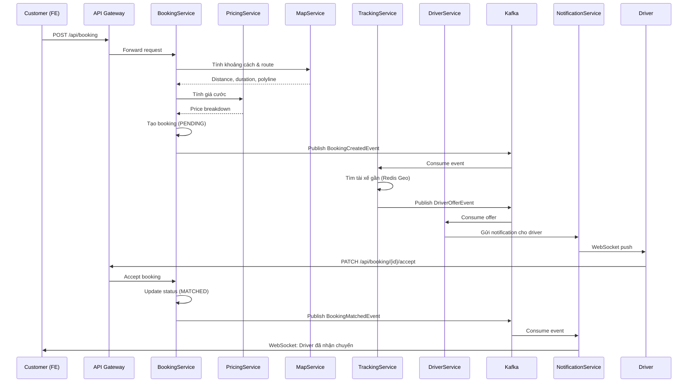
```mermaid
sequenceDiagram
    participant C as Customer (FE)
    participant GW as API Gateway
    participant BS as BookingService
    participant PS as PricingService
    participant MS as MapService
    participant TS as TrackingService
    participant DS as DriverService
    participant K as Kafka
    participant NS as NotificationService

    C->>GW: POST /api/booking
    GW->>BS: Forward request
    BS->>MS: Tính khoảng cách & route
    MS-->>BS: Distance, duration, polyline
    BS->>PS: Tính giá cước
    PS-->>BS: Price breakdown
    BS->>BS: Tạo booking (PENDING)
    BS->>K: Publish BookingCreatedEvent
    K->>TS: Consume event
    TS->>TS: Tìm tài xế gần (Redis Geo)
    TS->>K: Publish DriverOfferEvent
    K->>DS: Consume offer
    DS->>NS: Gửi notification cho driver
    NS->>Driver: WebSocket push
    Driver->>GW: PATCH /api/booking/{id}/accept
    GW->>BS: Accept booking
    BS->>BS: Update status (MATCHED)
    BS->>K: Publish BookingMatchedEvent
    K->>NS: Consume event
    NS->>C: WebSocket: Driver đã nhận chuyến
```

#### 2.4.2 Luồng thanh toán (Payment Flow)

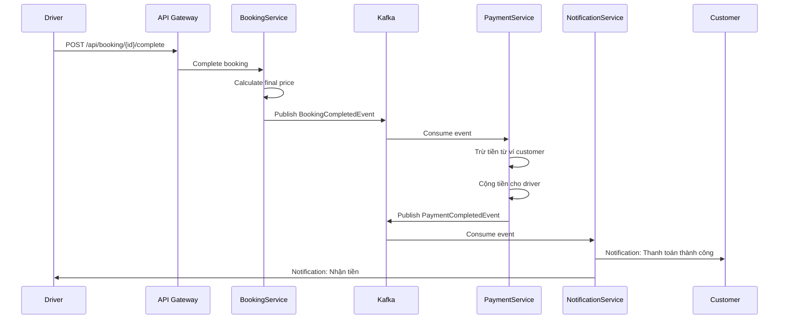
```mermaid
sequenceDiagram
    participant D as Driver
    participant GW as API Gateway
    participant BS as BookingService
    participant K as Kafka
    participant PayS as PaymentService
    participant NS as NotificationService
    participant C as Customer

    D->>GW: POST /api/booking/{id}/complete
    GW->>BS: Complete booking
    BS->>BS: Calculate final price
    BS->>K: Publish BookingCompletedEvent
    K->>PayS: Consume event
    PayS->>PayS: Trừ tiền từ ví customer
    PayS->>PayS: Cộng tiền cho driver
    PayS->>K: Publish PaymentCompletedEvent
    K->>NS: Consume event
    NS->>C: Notification: Thanh toán thành công
    NS->>D: Notification: Nhận tiền
```

#### 2.4.3 Luồng Saga Pattern (Compensation)

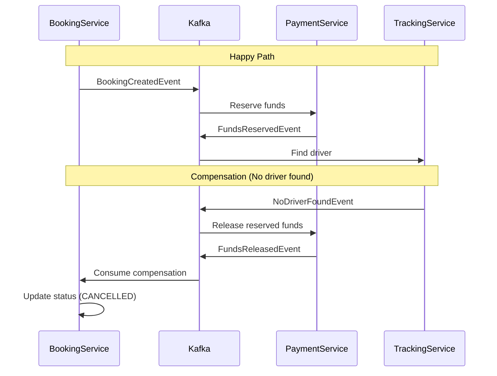
```mermaid
sequenceDiagram
    participant BS as BookingService
    participant K as Kafka
    participant PayS as PaymentService
    participant TS as TrackingService

    Note over BS,TS: Happy Path
    BS->>K: BookingCreatedEvent
    K->>PayS: Reserve funds
    PayS->>K: FundsReservedEvent
    K->>TS: Find driver

    Note over BS,TS: Compensation (No driver found)
    TS->>K: NoDriverFoundEvent
    K->>PayS: Release reserved funds
    PayS->>K: FundsReleasedEvent
    K->>BS: Consume compensation
    BS->>BS: Update status (CANCELLED)
```

---

#### 2.4.4 Luồng Đăng ký tài khoản (Registration Flow)

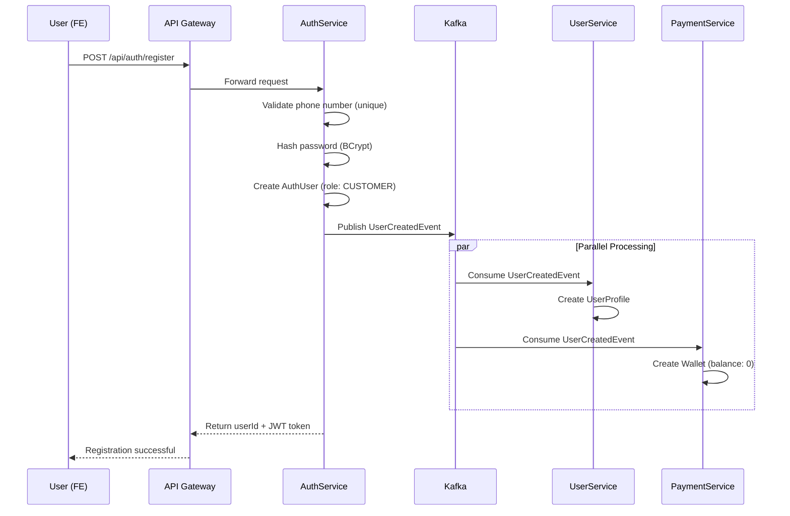
```mermaid
sequenceDiagram
    participant U as User (FE)
    participant GW as API Gateway
    participant AS as AuthService
    participant K as Kafka
    participant US as UserService
    participant PayS as PaymentService

    U->>GW: POST /api/auth/register
    GW->>AS: Forward request
    AS->>AS: Validate phone number (unique)
    AS->>AS: Hash password (BCrypt)
    AS->>AS: Create AuthUser (role: CUSTOMER)
    AS->>K: Publish UserCreatedEvent

    par Parallel Processing
        K->>US: Consume UserCreatedEvent
        US->>US: Create UserProfile

        K->>PayS: Consume UserCreatedEvent
        PayS->>PayS: Create Wallet (balance: 0)
    end

    AS-->>GW: Return userId + JWT token
    GW-->>U: Registration successful
```

---

#### 2.4.5 Luồng Đăng nhập (Login Flow)

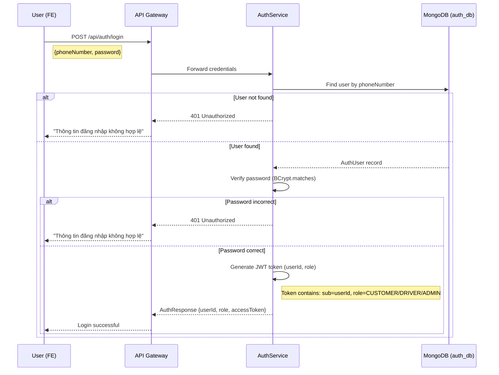
```mermaid
sequenceDiagram
    participant U as User (FE)
    participant GW as API Gateway
    participant AS as AuthService
    participant MongoDB as MongoDB (auth_db)

    U->>GW: POST /api/auth/login
    Note right of U: {phoneNumber, password}
    GW->>AS: Forward credentials
    AS->>MongoDB: Find user by phoneNumber

    alt User not found
        AS-->>GW: 401 Unauthorized
        GW-->>U: "Thông tin đăng nhập không hợp lệ"
    else User found
        MongoDB-->>AS: AuthUser record
        AS->>AS: Verify password (BCrypt.matches)

        alt Password incorrect
            AS-->>GW: 401 Unauthorized
            GW-->>U: "Thông tin đăng nhập không hợp lệ"
        else Password correct
            AS->>AS: Generate JWT token (userId, role)
            Note right of AS: Token contains: sub=userId, role=CUSTOMER/DRIVER/ADMIN
            AS-->>GW: AuthResponse {userId, role, accessToken}
            GW-->>U: Login successful
        end
    end
```

---

#### 2.4.6 Luồng Đăng ký làm Tài xế (Driver Registration Flow)

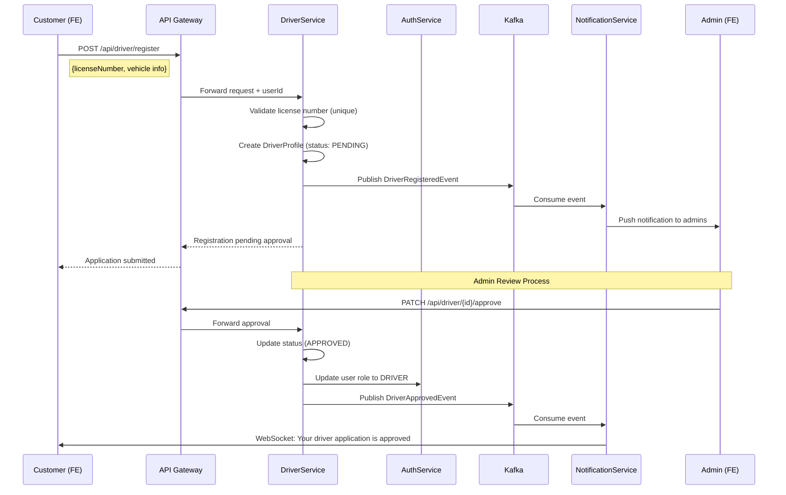
```mermaid
sequenceDiagram
    participant C as Customer (FE)
    participant GW as API Gateway
    participant DS as DriverService
    participant AS as AuthService
    participant K as Kafka
    participant NS as NotificationService
    participant Admin as Admin (FE)

    C->>GW: POST /api/driver/register
    Note right of C: {licenseNumber, vehicle info}
    GW->>DS: Forward request + userId
    DS->>DS: Validate license number (unique)
    DS->>DS: Create DriverProfile (status: PENDING)
    DS->>K: Publish DriverRegisteredEvent

    K->>NS: Consume event
    NS->>Admin: Push notification to admins

    DS-->>GW: Registration pending approval
    GW-->>C: Application submitted

    Note over Admin,DS: Admin Review Process
    Admin->>GW: PATCH /api/driver/{id}/approve
    GW->>DS: Forward approval
    DS->>DS: Update status (APPROVED)
    DS->>AS: Update user role to DRIVER
    DS->>K: Publish DriverApprovedEvent

    K->>NS: Consume event
    NS->>C: WebSocket: Your driver application is approved
```

---

#### 2.4.7 Luồng Theo dõi Vị trí Real-time (Real-time Tracking Flow)

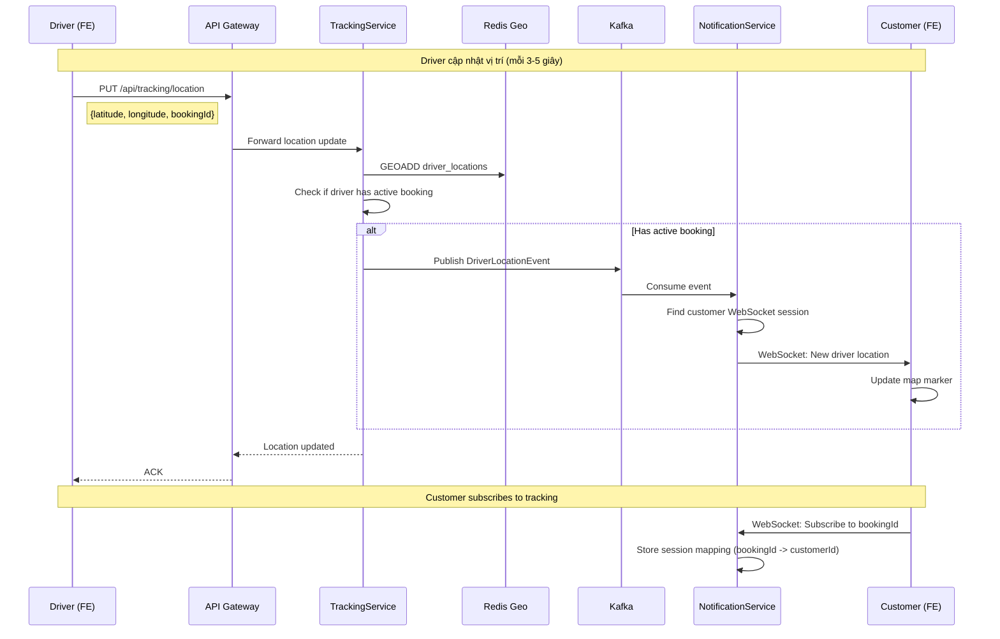
```mermaid
sequenceDiagram
    participant D as Driver (FE)
    participant GW as API Gateway
    participant TS as TrackingService
    participant Redis as Redis Geo
    participant K as Kafka
    participant NS as NotificationService
    participant C as Customer (FE)

    Note over D,C: Driver cập nhật vị trí (mỗi 3-5 giây)

    D->>GW: PUT /api/tracking/location
    Note right of D: {latitude, longitude, bookingId}
    GW->>TS: Forward location update
    TS->>Redis: GEOADD driver_locations
    TS->>TS: Check if driver has active booking

    alt Has active booking
        TS->>K: Publish DriverLocationEvent
        K->>NS: Consume event
        NS->>NS: Find customer WebSocket session
        NS->>C: WebSocket: New driver location
        C->>C: Update map marker
    end

    TS-->>GW: Location updated
    GW-->>D: ACK

    Note over D,C: Customer subscribes to tracking
    C->>NS: WebSocket: Subscribe to bookingId
    NS->>NS: Store session mapping (bookingId -> customerId)
```

---

#### 2.4.8 Luồng Nạp tiền qua VNPay (VNPay Top-up Flow)

##### a) Khởi tạo thanh toán VNPay

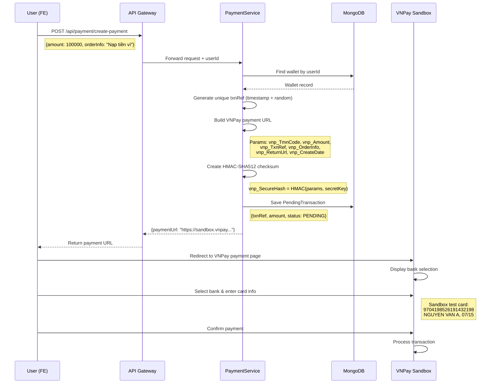
```mermaid
sequenceDiagram
    participant U as User (FE)
    participant GW as API Gateway
    participant PayS as PaymentService
    participant MongoDB as MongoDB
    participant VNPay as VNPay Sandbox

    U->>GW: POST /api/payment/create-payment
    Note right of U: {amount: 100000, orderInfo: "Nạp tiền ví"}
    GW->>PayS: Forward request + userId

    PayS->>MongoDB: Find wallet by userId
    MongoDB-->>PayS: Wallet record

    PayS->>PayS: Generate unique txnRef (timestamp + random)
    PayS->>PayS: Build VNPay payment URL
    Note right of PayS: Params: vnp_TmnCode, vnp_Amount,<br/>vnp_TxnRef, vnp_OrderInfo,<br/>vnp_ReturnUrl, vnp_CreateDate

    PayS->>PayS: Create HMAC-SHA512 checksum
    Note right of PayS: vnp_SecureHash = HMAC(params, secretKey)

    PayS->>MongoDB: Save PendingTransaction
    Note right of PayS: {txnRef, amount, status: PENDING}

    PayS-->>GW: {paymentUrl: "https://sandbox.vnpay..."}
    GW-->>U: Return payment URL

    U->>VNPay: Redirect to VNPay payment page
    VNPay->>VNPay: Display bank selection
    U->>VNPay: Select bank & enter card info
    Note right of VNPay: Sandbox test card:<br/>9704198526191432198<br/>NGUYEN VAN A, 07/15
    U->>VNPay: Confirm payment
    VNPay->>VNPay: Process transaction
```

##### b) Xử lý Callback từ VNPay

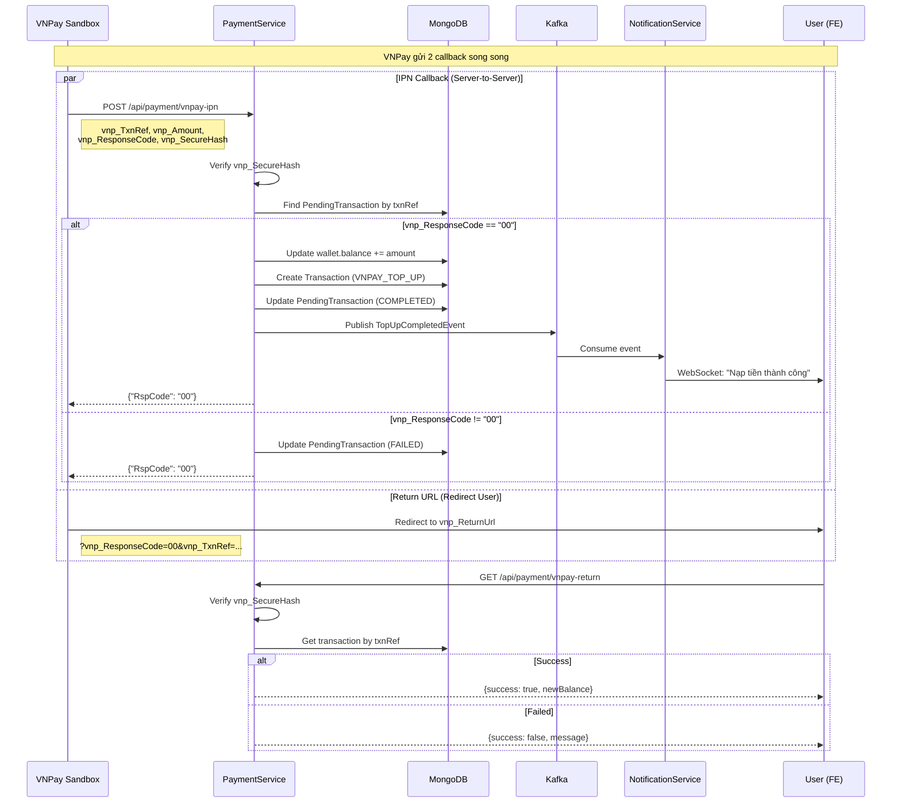
```mermaid
sequenceDiagram
    participant VNPay as VNPay Sandbox
    participant PayS as PaymentService
    participant MongoDB as MongoDB
    participant K as Kafka
    participant NS as NotificationService
    participant U as User (FE)

    Note over VNPay,U: VNPay gửi 2 callback song song

    par IPN Callback (Server-to-Server)
        VNPay->>PayS: POST /api/payment/vnpay-ipn
        Note right of VNPay: vnp_TxnRef, vnp_Amount,<br/>vnp_ResponseCode, vnp_SecureHash

        PayS->>PayS: Verify vnp_SecureHash
        PayS->>MongoDB: Find PendingTransaction by txnRef

        alt vnp_ResponseCode == "00"
            PayS->>MongoDB: Update wallet.balance += amount
            PayS->>MongoDB: Create Transaction (VNPAY_TOP_UP)
            PayS->>MongoDB: Update PendingTransaction (COMPLETED)
            PayS->>K: Publish TopUpCompletedEvent

            K->>NS: Consume event
            NS->>U: WebSocket: "Nạp tiền thành công"

            PayS-->>VNPay: {"RspCode": "00"}
        else vnp_ResponseCode != "00"
            PayS->>MongoDB: Update PendingTransaction (FAILED)
            PayS-->>VNPay: {"RspCode": "00"}
        end
    and Return URL (Redirect User)
        VNPay->>U: Redirect to vnp_ReturnUrl
        Note right of VNPay: ?vnp_ResponseCode=00&vnp_TxnRef=...
    end

    U->>PayS: GET /api/payment/vnpay-return
    PayS->>PayS: Verify vnp_SecureHash
    PayS->>MongoDB: Get transaction by txnRef

    alt Success
        PayS-->>U: {success: true, newBalance}
    else Failed
        PayS-->>U: {success: false, message}
    end
```

**Cấu hình VNPay Sandbox:**

| Parameter        | Value                                                |
| ---------------- | ---------------------------------------------------- |
| `vnp_TmnCode`    | Mã website của merchant (VNPay cấp)                  |
| `vnp_HashSecret` | Secret key để tạo checksum                           |
| `vnp_Url`        | `https://sandbox.vnpayment.vn/paymentv2/vpcpay.html` |
| `vnp_ReturnUrl`  | `https://your-domain.com/payment/result`             |
| `vnp_IpnUrl`     | `https://your-domain.com/api/payment/vnpay-ipn`      |

---

#### 2.4.9 Luồng Đánh giá sau Chuyến đi (Review Flow)

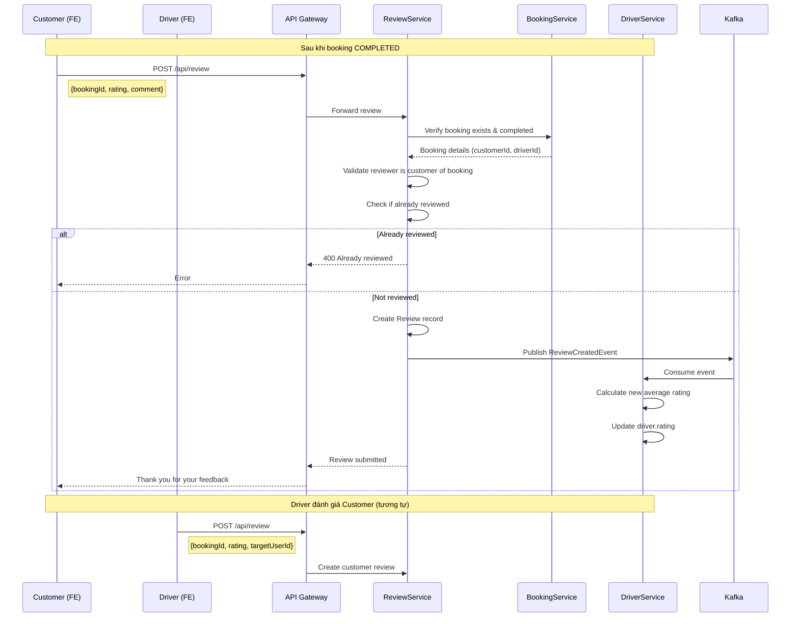
```mermaid
sequenceDiagram
    participant C as Customer (FE)
    participant D as Driver (FE)
    participant GW as API Gateway
    participant RS as ReviewService
    participant BS as BookingService
    participant DS as DriverService
    participant K as Kafka

    Note over C,DS: Sau khi booking COMPLETED

    C->>GW: POST /api/review
    Note right of C: {bookingId, rating, comment}
    GW->>RS: Forward review

    RS->>BS: Verify booking exists & completed
    BS-->>RS: Booking details (customerId, driverId)

    RS->>RS: Validate reviewer is customer of booking
    RS->>RS: Check if already reviewed

    alt Already reviewed
        RS-->>GW: 400 Already reviewed
        GW-->>C: Error
    else Not reviewed
        RS->>RS: Create Review record
        RS->>K: Publish ReviewCreatedEvent

        K->>DS: Consume event
        DS->>DS: Calculate new average rating
        DS->>DS: Update driver.rating

        RS-->>GW: Review submitted
        GW-->>C: Thank you for your feedback
    end

    Note over C,DS: Driver đánh giá Customer (tương tự)
    D->>GW: POST /api/review
    Note right of D: {bookingId, rating, targetUserId}
    GW->>RS: Create customer review
```

---

#### 2.4.10 Luồng Hủy Booking (Cancel Booking Flow)

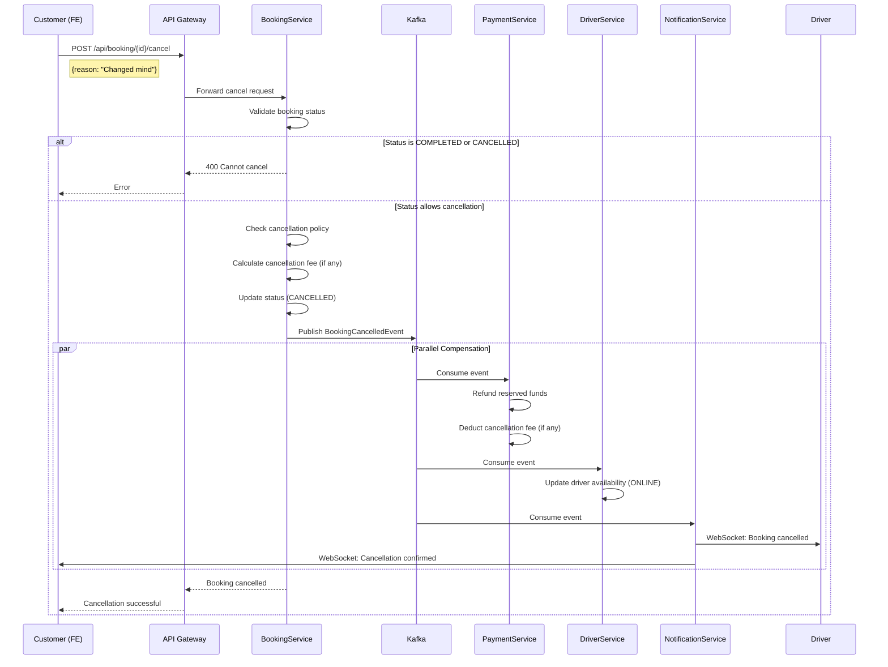
```mermaid
sequenceDiagram
    participant C as Customer (FE)
    participant GW as API Gateway
    participant BS as BookingService
    participant K as Kafka
    participant PayS as PaymentService
    participant DS as DriverService
    participant NS as NotificationService

    C->>GW: POST /api/booking/{id}/cancel
    Note right of C: {reason: "Changed mind"}
    GW->>BS: Forward cancel request

    BS->>BS: Validate booking status

    alt Status is COMPLETED or CANCELLED
        BS-->>GW: 400 Cannot cancel
        GW-->>C: Error
    else Status allows cancellation
        BS->>BS: Check cancellation policy
        BS->>BS: Calculate cancellation fee (if any)
        BS->>BS: Update status (CANCELLED)
        BS->>K: Publish BookingCancelledEvent

        par Parallel Compensation
            K->>PayS: Consume event
            PayS->>PayS: Refund reserved funds
            PayS->>PayS: Deduct cancellation fee (if any)

            K->>DS: Consume event
            DS->>DS: Update driver availability (ONLINE)

            K->>NS: Consume event
            NS->>Driver: WebSocket: Booking cancelled
            NS->>C: WebSocket: Cancellation confirmed
        end

        BS-->>GW: Booking cancelled
        GW-->>C: Cancellation successful
    end
```

---

#### 2.4.11 Luồng Tìm Tài xế Gần nhất (Find Nearby Driver Flow)

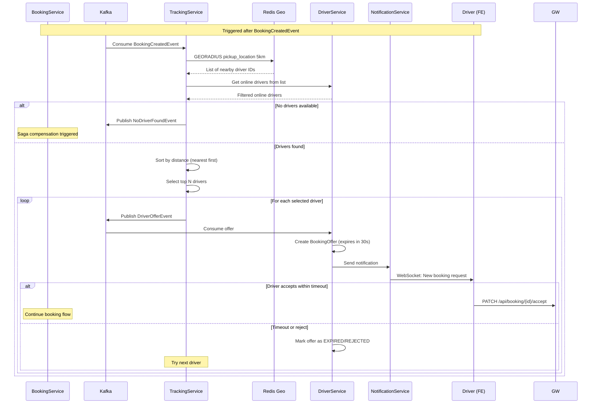
```mermaid
sequenceDiagram
    participant BS as BookingService
    participant K as Kafka
    participant TS as TrackingService
    participant Redis as Redis Geo
    participant DS as DriverService
    participant NS as NotificationService
    participant D as Driver (FE)

    Note over BS,D: Triggered after BookingCreatedEvent

    K->>TS: Consume BookingCreatedEvent
    TS->>Redis: GEORADIUS pickup_location 5km
    Redis-->>TS: List of nearby driver IDs

    TS->>DS: Get online drivers from list
    DS-->>TS: Filtered online drivers

    alt No drivers available
        TS->>K: Publish NoDriverFoundEvent
        Note over BS: Saga compensation triggered
    else Drivers found
        TS->>TS: Sort by distance (nearest first)
        TS->>TS: Select top N drivers

        loop For each selected driver
            TS->>K: Publish DriverOfferEvent
            K->>DS: Consume offer
            DS->>DS: Create BookingOffer (expires in 30s)
            DS->>NS: Send notification
            NS->>D: WebSocket: New booking request

            alt Driver accepts within timeout
                D->>GW: PATCH /api/booking/{id}/accept
                Note over BS: Continue booking flow
            else Timeout or reject
                DS->>DS: Mark offer as EXPIRED/REJECTED
                Note over TS: Try next driver
            end
        end
    end
```

---

#### 2.4.12 Luồng Driver Bật/Tắt Online (Driver Online Toggle Flow)

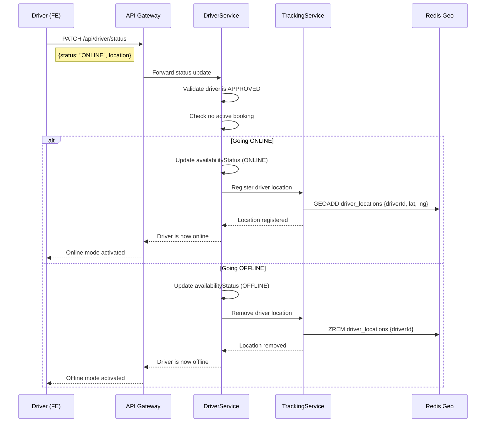
```mermaid
sequenceDiagram
    participant D as Driver (FE)
    participant GW as API Gateway
    participant DS as DriverService
    participant TS as TrackingService
    participant Redis as Redis Geo

    D->>GW: PATCH /api/driver/status
    Note right of D: {status: "ONLINE", location}
    GW->>DS: Forward status update

    DS->>DS: Validate driver is APPROVED
    DS->>DS: Check no active booking

    alt Going ONLINE
        DS->>DS: Update availabilityStatus (ONLINE)
        DS->>TS: Register driver location
        TS->>Redis: GEOADD driver_locations {driverId, lat, lng}
        TS-->>DS: Location registered
        DS-->>GW: Driver is now online
        GW-->>D: Online mode activated
    else Going OFFLINE
        DS->>DS: Update availabilityStatus (OFFLINE)
        DS->>TS: Remove driver location
        TS->>Redis: ZREM driver_locations {driverId}
        TS-->>DS: Location removed
        DS-->>GW: Driver is now offline
        GW-->>D: Offline mode activated
    end
```

---

#### 2.4.13 Luồng Hoàn thành Chuyến đi Đầy đủ (Complete Trip End-to-End Flow)

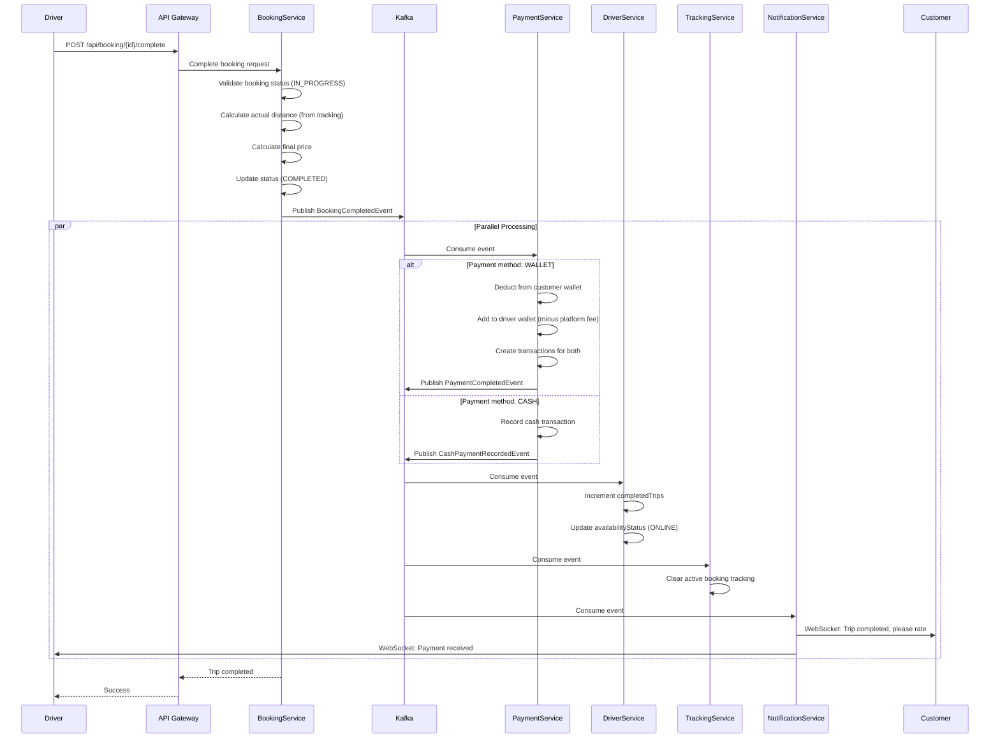
```mermaid
sequenceDiagram
    participant D as Driver
    participant GW as API Gateway
    participant BS as BookingService
    participant K as Kafka
    participant PayS as PaymentService
    participant DS as DriverService
    participant TS as TrackingService
    participant NS as NotificationService
    participant C as Customer

    D->>GW: POST /api/booking/{id}/complete
    GW->>BS: Complete booking request

    BS->>BS: Validate booking status (IN_PROGRESS)
    BS->>BS: Calculate actual distance (from tracking)
    BS->>BS: Calculate final price
    BS->>BS: Update status (COMPLETED)
    BS->>K: Publish BookingCompletedEvent

    par Parallel Processing
        K->>PayS: Consume event
        alt Payment method: WALLET
            PayS->>PayS: Deduct from customer wallet
            PayS->>PayS: Add to driver wallet (minus platform fee)
            PayS->>PayS: Create transactions for both
            PayS->>K: Publish PaymentCompletedEvent
        else Payment method: CASH
            PayS->>PayS: Record cash transaction
            PayS->>K: Publish CashPaymentRecordedEvent
        end

        K->>DS: Consume event
        DS->>DS: Increment completedTrips
        DS->>DS: Update availabilityStatus (ONLINE)

        K->>TS: Consume event
        TS->>TS: Clear active booking tracking

        K->>NS: Consume event
        NS->>C: WebSocket: Trip completed, please rate
        NS->>D: WebSocket: Payment received
    end

    BS-->>GW: Trip completed
    GW-->>D: Success
```

---

#### 2.4.14 Luồng Ước tính Giá Cước (Price Estimation Flow)

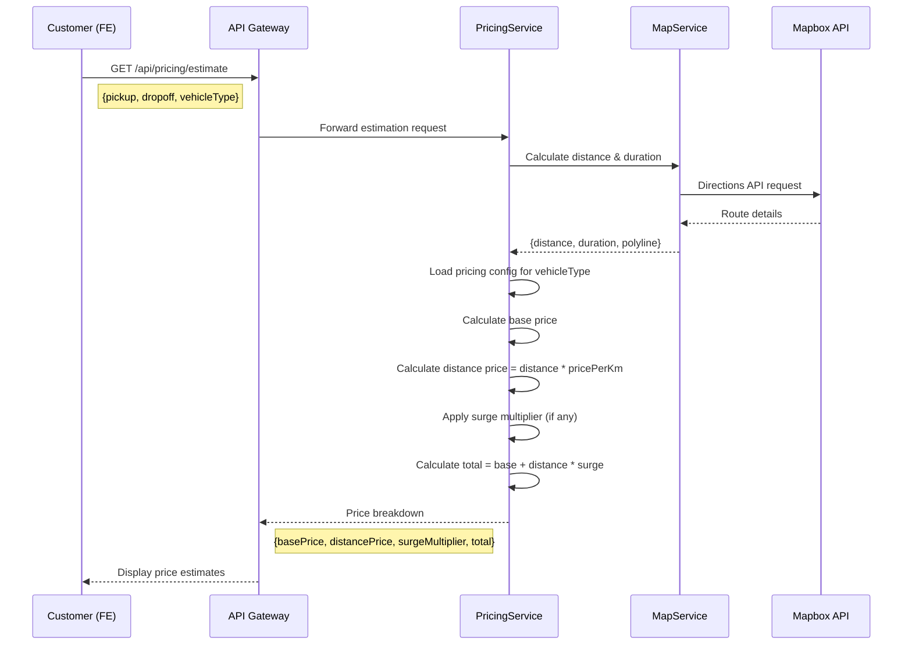
```mermaid
sequenceDiagram
    participant C as Customer (FE)
    participant GW as API Gateway
    participant PS as PricingService
    participant MS as MapService
    participant Mapbox as Mapbox API

    C->>GW: GET /api/pricing/estimate
    Note right of C: {pickup, dropoff, vehicleType}
    GW->>PS: Forward estimation request

    PS->>MS: Calculate distance & duration
    MS->>Mapbox: Directions API request
    Mapbox-->>MS: Route details
    MS-->>PS: {distance, duration, polyline}

    PS->>PS: Load pricing config for vehicleType
    PS->>PS: Calculate base price
    PS->>PS: Calculate distance price = distance * pricePerKm
    PS->>PS: Apply surge multiplier (if any)
    PS->>PS: Calculate total = base + distance * surge

    PS-->>GW: Price breakdown
    Note left of PS: {basePrice, distancePrice, surgeMultiplier, total}
    GW-->>C: Display price estimates
```

---

## 3. PHÂN TÍCH VÀ THIẾT KẾ DỮ LIỆU CỦA HỆ THỐNG

### 3.1 Mô hình thực thể liên kết của từng dịch vụ

#### 3.1.1 BookingService - ERD

> **MongoDB Collection:** `bookings`
>
> - `ADDRESS_SNAPSHOT` và `BOOKING_PRICE_SNAPSHOT` là **embedded documents** trong `BOOKING`

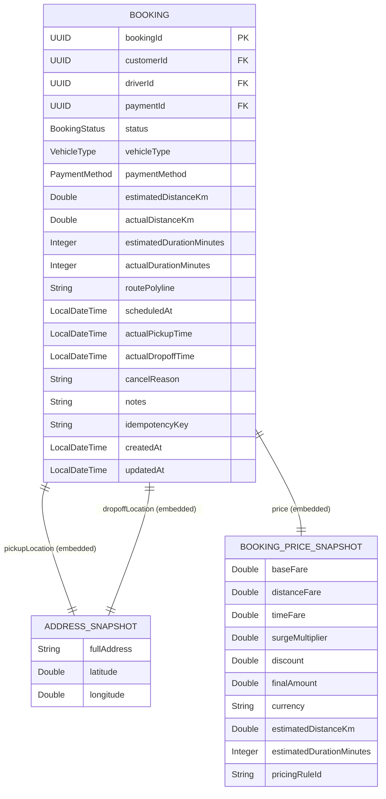
```mermaid
erDiagram
    BOOKING {
        UUID bookingId PK
        UUID customerId FK
        UUID driverId FK
        UUID paymentId FK
        BookingStatus status
        VehicleType vehicleType
        PaymentMethod paymentMethod
        Double estimatedDistanceKm
        Double actualDistanceKm
        Integer estimatedDurationMinutes
        Integer actualDurationMinutes
        String routePolyline
        LocalDateTime scheduledAt
        LocalDateTime actualPickupTime
        LocalDateTime actualDropoffTime
        String cancelReason
        String notes
        String idempotencyKey
        LocalDateTime createdAt
        LocalDateTime updatedAt
    }

    ADDRESS_SNAPSHOT {
        String fullAddress
        Double latitude
        Double longitude
    }

    BOOKING_PRICE_SNAPSHOT {
        Double baseFare
        Double distanceFare
        Double timeFare
        Double surgeMultiplier
        Double discount
        Double finalAmount
        String currency
        Double estimatedDistanceKm
        Integer estimatedDurationMinutes
        String pricingRuleId
    }

    BOOKING ||--|| ADDRESS_SNAPSHOT : "pickupLocation (embedded)"
    BOOKING ||--|| ADDRESS_SNAPSHOT : "dropoffLocation (embedded)"
    BOOKING ||--|| BOOKING_PRICE_SNAPSHOT : "price (embedded)"
```

#### 3.1.2 DriverService - ERD

> **MongoDB Collections:**
>
> - `driver_profiles` - chứa `DRIVER_PROFILE` với `DRIVER_VEHICLE` là **embedded document**
> - `driver_booking_offers` - collection riêng cho `DRIVER_BOOKING_OFFER`

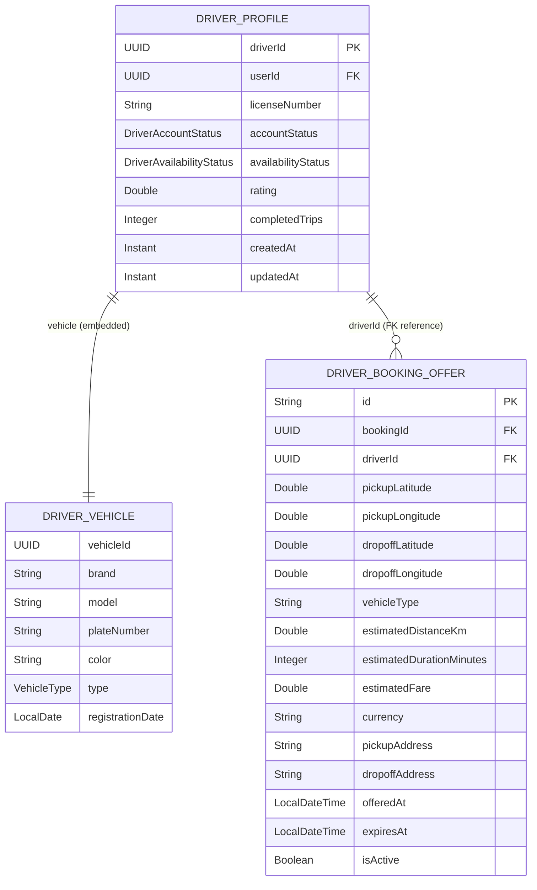
```mermaid
erDiagram
    DRIVER_PROFILE {
        UUID driverId PK
        UUID userId FK
        String licenseNumber
        DriverAccountStatus accountStatus
        DriverAvailabilityStatus availabilityStatus
        Double rating
        Integer completedTrips
        Instant createdAt
        Instant updatedAt
    }

    DRIVER_VEHICLE {
        UUID vehicleId
        String brand
        String model
        String plateNumber
        String color
        VehicleType type
        LocalDate registrationDate
    }

    DRIVER_BOOKING_OFFER {
        String id PK
        UUID bookingId FK
        UUID driverId FK
        Double pickupLatitude
        Double pickupLongitude
        Double dropoffLatitude
        Double dropoffLongitude
        String vehicleType
        Double estimatedDistanceKm
        Integer estimatedDurationMinutes
        Double estimatedFare
        String currency
        String pickupAddress
        String dropoffAddress
        LocalDateTime offeredAt
        LocalDateTime expiresAt
        Boolean isActive
    }

    DRIVER_PROFILE ||--|| DRIVER_VEHICLE : "vehicle (embedded)"
    DRIVER_PROFILE ||--o{ DRIVER_BOOKING_OFFER : "driverId (FK reference)"
```

#### 3.1.3 PaymentService - ERD

> **MongoDB Collections:**
>
> - `wallets` - chứa thông tin ví điện tử
> - `transactions` - chứa lịch sử giao dịch

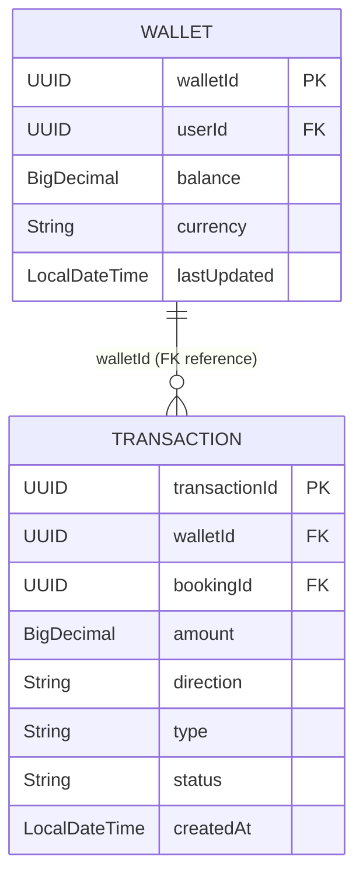
```mermaid
erDiagram
    WALLET {
        UUID walletId PK
        UUID userId FK
        BigDecimal balance
        String currency
        LocalDateTime lastUpdated
    }

    TRANSACTION {
        UUID transactionId PK
        UUID walletId FK
        UUID bookingId FK
        BigDecimal amount
        String direction
        String type
        String status
        LocalDateTime createdAt
    }

    WALLET ||--o{ TRANSACTION : "walletId (FK reference)"
```

#### 3.1.4 AuthService - ERD

> **MongoDB Collection:** `auth_users`

```mermaid

```

#### 3.1.5 UserService - ERD

> **MongoDB Collection:** `user_profiles`
>
> - `ADDRESS` là **embedded document** trong `USER_PROFILE`

```mermaid
erDiagram
    USER_PROFILE {
        UUID userId PK
        String fullName
        String phone
        String email
        Date dateOfBirth
    }

    ADDRESS {
        String street
        String city
        String state
        String zipCode
        String country
    }

    USER_PROFILE ||--o| ADDRESS : "address (embedded)"
```

#### 3.1.6 PricingService - ERD

> **MongoDB Collection:** `pricing_rules`

```mermaid
erDiagram
    PRICING_RULE {
        UUID ruleId PK
        String vehicleType
        Double baseFare
        Double perKmRate
        Double perMinuteRate
        Double surgeMultiplier
        String region
        Boolean active
    }
```

#### 3.1.7 ReviewService - ERD

> **MongoDB Collection:** `reviews`

```mermaid
erDiagram
    REVIEW {
        UUID reviewId PK
        UUID bookingId FK
        UUID reviewerId FK
        UUID revieweeId FK
        Double rating
        String comment
        LocalDateTime createdAt
        Boolean deleted
    }
```

#### 3.1.8 NotificationService - ERD

> **MongoDB Collections:**
>
> - `notifications` - chứa thông báo
> - `user_device_tokens` - chứa token thiết bị người dùng

```mermaid
erDiagram
    NOTIFICATION {
        String id PK
        UUID eventId UK
        UUID userId FK
        NotificationType type
        Map payload
        Boolean isRead
        Instant createdAt
    }

    USER_DEVICE_TOKEN {
        String id PK
        UUID userId FK
        String fcmToken
        DeviceType deviceType
        LocalDateTime lastUpdated
    }
```

#### 3.1.9 TrackingService - Redis Data Model

> **Lưu trữ:** Redis (không phải MongoDB)
>
> - Sử dụng **Redis Geo** để lưu vị trí tài xế và tìm kiếm theo khoảng cách
> - Sử dụng **Redis Hash/String** để lưu trạng thái tìm kiếm booking

```mermaid
erDiagram
    DRIVER_GEO_STATE {
        String driverId PK
        Double latitude
        Double longitude
        DriverAvailabilityStatus status
        VehicleType vehicleType
        Long lastUpdatedAt
    }

    BOOKING_SEARCH_STATE {
        UUID bookingId PK
        Double pickupLatitude
        Double pickupLongitude
        Double dropoffLatitude
        Double dropoffLongitude
        String vehicleType
        Double currentRadiusMeters
        Integer searchAttempts
        LocalDateTime searchStartTime
        LocalDateTime lastSearchTime
        Boolean isActive
        Double estimatedDistanceKm
        Integer estimatedDurationMinutes
        Double estimatedFare
        String currency
        String pickupAddress
        String dropoffAddress
        Set notifiedDriverIds
    }
```

---

### 3.2 Mô hình quan hệ của từng dịch vụ

#### 3.2.1 Quan hệ giữa các Services

```mermaid
flowchart LR
    subgraph "Data Flow"
        A[AuthService] -->|userId| B[UserService]
        B -->|userId| C[PaymentService]
        B -->|userId| D[DriverService]
        E[BookingService] -->|customerId| B
        E -->|driverId| D
        E -->|price| F[PricingService]
        E -->|location| G[MapService]
        E -->|tracking| H[TrackingService]
        E -->|paymentId| C
        I[ReviewService] -->|bookingId| E
        J[NotificationService] -->|userId| B
    end
```

#### 3.2.2 Quan hệ qua Kafka Topics

| Topic               | Producer        | Consumer                            | Mô tả                  |
| ------------------- | --------------- | ----------------------------------- | ---------------------- |
| `booking.created`   | BookingService  | TrackingService, PaymentService     | Booking mới được tạo   |
| `booking.matched`   | BookingService  | NotificationService                 | Driver đã nhận booking |
| `booking.completed` | BookingService  | PaymentService, ReviewService       | Chuyến đi hoàn thành   |
| `booking.cancelled` | BookingService  | PaymentService, NotificationService | Booking bị hủy         |
| `driver.location`   | TrackingService | NotificationService                 | Vị trí driver cập nhật |
| `driver.offer`      | TrackingService | DriverService                       | Offer cho driver gần   |
| `payment.completed` | PaymentService  | NotificationService                 | Thanh toán thành công  |
| `user.created`      | AuthService     | UserService, PaymentService         | User mới đăng ký       |

---

### 3.3 Bảng dữ liệu

#### 3.3.1 Collection: bookings (BookingService)

| Field                    | Type          | Constraint      | Mô tả                                                               |
| ------------------------ | ------------- | --------------- | ------------------------------------------------------------------- |
| bookingId                | UUID          | PK              | ID booking                                                          |
| customerId               | UUID          | Index, Required | ID khách hàng                                                       |
| driverId                 | UUID          | Index, Nullable | ID tài xế                                                           |
| paymentId                | UUID          | Index, Nullable | ID thanh toán                                                       |
| status                   | BookingStatus | Index, Required | PENDING, MATCHED, DRIVER_ARRIVED, IN_PROGRESS, COMPLETED, CANCELLED |
| pickupLocation           | Object        | Required        | {fullAddress, latitude, longitude}                                  |
| dropoffLocation          | Object        | Required        | {fullAddress, latitude, longitude}                                  |
| vehicleType              | VehicleType   | Required        | BIKE, CAR_4_SEAT, CAR_7_SEAT                                        |
| paymentMethod            | PaymentMethod | Required        | WALLET, CASH                                                        |
| price                    | Object        | Required        | {baseFare, distanceFare, timeFare, surgeMultiplier, finalAmount}    |
| estimatedDistanceKm      | Double        | Required        | Khoảng cách ước tính                                                |
| actualDistanceKm         | Double        | Nullable        | Khoảng cách thực tế                                                 |
| estimatedDurationMinutes | Integer       | Required        | Thời gian ước tính                                                  |
| actualDurationMinutes    | Integer       | Nullable        | Thời gian thực tế                                                   |
| routePolyline            | String        | Nullable        | Encoded polyline từ MapService                                      |
| scheduledAt              | LocalDateTime | Nullable        | Thời điểm đặt trước (null nếu đặt ngay)                             |
| actualPickupTime         | LocalDateTime | Nullable        | Thời điểm đón thực tế                                               |
| actualDropoffTime        | LocalDateTime | Nullable        | Thời điểm trả thực tế                                               |
| cancelReason             | String        | Nullable        | Lý do hủy                                                           |
| notes                    | String        | Nullable        | Ghi chú                                                             |
| idempotencyKey           | String        | Nullable        | Key đảm bảo idempotent                                              |
| createdAt                | LocalDateTime | Required        | Thời gian tạo                                                       |
| updatedAt                | LocalDateTime | Required        | Thời gian cập nhật                                                  |

#### 3.3.2 Collection: driver_profiles (DriverService)

| Field              | Type                     | Constraint       | Mô tả                                                                 |
| ------------------ | ------------------------ | ---------------- | --------------------------------------------------------------------- |
| driverId           | UUID                     | PK               | ID tài xế                                                             |
| userId             | UUID                     | Unique, Required | ID user liên kết                                                      |
| licenseNumber      | String                   | Required         | Số giấy phép lái xe                                                   |
| accountStatus      | DriverAccountStatus      | Required         | PENDING, APPROVED, REJECTED, SUSPENDED                                |
| availabilityStatus | DriverAvailabilityStatus | Required         | OFFLINE, ONLINE, BUSY                                                 |
| rating             | Double                   | Default: 5.0     | Rating trung bình                                                     |
| completedTrips     | Integer                  | Default: 0       | Số chuyến hoàn thành                                                  |
| vehicle            | Object                   | Required         | {vehicleId, brand, model, plateNumber, color, type, registrationDate} |
| createdAt          | Instant                  | Required         | Thời gian đăng ký                                                     |
| updatedAt          | Instant                  | Required         | Thời gian cập nhật                                                    |

#### 3.3.3 Collection: driver_booking_offers (DriverService)

| Field                    | Type          | Constraint      | Mô tả                        |
| ------------------------ | ------------- | --------------- | ---------------------------- |
| id                       | String        | PK              | ID offer (auto-generated)    |
| bookingId                | UUID          | Index, Required | ID booking                   |
| driverId                 | UUID          | Index, Required | ID tài xế nhận offer         |
| pickupLatitude           | Double        | Required        | Vĩ độ điểm đón               |
| pickupLongitude          | Double        | Required        | Kinh độ điểm đón             |
| pickupAddress            | String        | Nullable        | Địa chỉ điểm đón             |
| dropoffLatitude          | Double        | Required        | Vĩ độ điểm trả               |
| dropoffLongitude         | Double        | Required        | Kinh độ điểm trả             |
| dropoffAddress           | String        | Nullable        | Địa chỉ điểm trả             |
| vehicleType              | String        | Required        | Loại xe yêu cầu              |
| estimatedDistanceKm      | Double        | Nullable        | Khoảng cách ước tính         |
| estimatedDurationMinutes | Integer       | Nullable        | Thời gian ước tính           |
| estimatedFare            | Double        | Nullable        | Giá ước tính                 |
| currency                 | String        | Default: VND    | Loại tiền tệ                 |
| offeredAt                | LocalDateTime | Required        | Thời điểm gửi offer          |
| expiresAt                | LocalDateTime | Required        | Thời điểm hết hạn (30 giây)  |
| isActive                 | Boolean       | Default: true   | Offer còn hiệu lực hay không |

#### 3.3.4 Collection: wallets (PaymentService)

| Field       | Type          | Constraint       | Mô tả             |
| ----------- | ------------- | ---------------- | ----------------- |
| walletId    | UUID          | PK               | ID ví             |
| userId      | UUID          | Unique, Required | ID user sở hữu    |
| balance     | BigDecimal    | Required         | Số dư hiện tại    |
| currency    | String        | Default: VND     | Loại tiền tệ      |
| lastUpdated | LocalDateTime | Required         | Lần cập nhật cuối |

#### 3.3.5 Collection: transactions (PaymentService)

| Field         | Type          | Constraint      | Mô tả                        |
| ------------- | ------------- | --------------- | ---------------------------- |
| transactionId | UUID          | PK              | ID giao dịch                 |
| walletId      | UUID          | Index, Required | ID ví liên quan              |
| bookingId     | UUID          | Nullable        | ID booking liên quan         |
| amount        | BigDecimal    | Required        | Số tiền                      |
| direction     | String        | Required        | IN (nạp), OUT (trừ)          |
| type          | String        | Required        | TOP_UP, RIDE_PAYMENT, REFUND |
| status        | String        | Required        | SUCCESS, FAILED              |
| createdAt     | LocalDateTime | Required        | Thời gian giao dịch          |

#### 3.3.6 Collection: auth_users (AuthService)

| Field        | Type          | Constraint       | Mô tả                     |
| ------------ | ------------- | ---------------- | ------------------------- |
| userId       | UUID          | PK               | ID user                   |
| phoneNumber  | String        | Unique, Required | Số điện thoại đăng nhập   |
| passwordHash | String        | Required         | Mật khẩu đã mã hóa BCrypt |
| provider     | AuthProvider  | Required         | LOCAL, GOOGLE, FACEBOOK   |
| role         | Role          | Required         | CUSTOMER, DRIVER, ADMIN   |
| createdAt    | LocalDateTime | Required         | Thời gian tạo tài khoản   |

#### 3.3.7 Collection: user_profiles (UserService)

| Field       | Type   | Constraint | Mô tả                                   |
| ----------- | ------ | ---------- | --------------------------------------- |
| userId      | UUID   | PK         | ID user (liên kết với AuthService)      |
| fullName    | String | Nullable   | Họ tên đầy đủ                           |
| phone       | String | Nullable   | Số điện thoại                           |
| email       | String | Nullable   | Email                                   |
| address     | Object | Nullable   | {street, city, state, zipCode, country} |
| dateOfBirth | Date   | Nullable   | Ngày sinh                               |

#### 3.3.8 Collection: pricing_rules (PricingService)

| Field           | Type    | Constraint    | Mô tả                              |
| --------------- | ------- | ------------- | ---------------------------------- |
| ruleId          | UUID    | PK            | ID quy tắc giá                     |
| vehicleType     | String  | Required      | BIKE, CAR_4_SEAT, CAR_7_SEAT       |
| baseFare        | Double  | Required      | Giá cơ bản                         |
| perKmRate       | Double  | Required      | Giá mỗi km                         |
| perMinuteRate   | Double  | Required      | Giá mỗi phút                       |
| surgeMultiplier | Double  | Default: 1.0  | Hệ số tăng giá cao điểm            |
| region          | String  | Required      | Khu vực áp dụng (HCM, HN...)       |
| active          | Boolean | Default: true | Quy tắc có đang được áp dụng không |

#### 3.3.9 Collection: reviews (ReviewService)

| Field      | Type          | Constraint                                  | Mô tả                    |
| ---------- | ------------- | ------------------------------------------- | ------------------------ |
| reviewId   | UUID          | PK                                          | ID đánh giá              |
| bookingId  | UUID          | Index, Required, Unique(bookingId+reviewer) | ID booking được đánh giá |
| reviewerId | UUID          | Index, Required                             | ID người đánh giá        |
| revieweeId | UUID          | Index, Required                             | ID người được đánh giá   |
| rating     | Double        | Required                                    | Số sao (1-5)             |
| comment    | String        | Nullable                                    | Bình luận                |
| createdAt  | LocalDateTime | Required                                    | Thời gian đánh giá       |
| deleted    | Boolean       | Default: false                              | Đánh dấu đã xóa          |

#### 3.3.10 Collection: notifications (NotificationService)

| Field     | Type                | Constraint       | Mô tả                                 |
| --------- | ------------------- | ---------------- | ------------------------------------- |
| id        | String              | PK               | ID notification (auto-generated)      |
| eventId   | UUID                | Unique, Required | ID event (idempotency key)            |
| userId    | UUID                | Index, Required  | ID user nhận thông báo                |
| type      | NotificationType    | Required         | BOOKING_UPDATE, PAYMENT, DRIVER_OFFER |
| payload   | Map<String, Object> | Required         | Dữ liệu thông báo                     |
| isRead    | Boolean             | Default: false   | Đã đọc hay chưa                       |
| createdAt | Instant             | Required         | Thời gian tạo                         |

#### 3.3.11 Collection: user_device_tokens (NotificationService)

| Field       | Type          | Constraint | Mô tả                          |
| ----------- | ------------- | ---------- | ------------------------------ |
| id          | String        | PK         | ID token (auto-generated)      |
| userId      | UUID          | Required   | ID user sở hữu thiết bị        |
| fcmToken    | String        | Required   | Firebase Cloud Messaging token |
| deviceType  | DeviceType    | Required   | ANDROID, IOS, WEB              |
| lastUpdated | LocalDateTime | Required   | Lần cập nhật cuối              |

#### 3.3.12 Redis: driver_locations (TrackingService)

> **Lưu trữ:** Redis Geo với key `driver_locations`

| Field     | Type   | Mô tả                           |
| --------- | ------ | ------------------------------- |
| driverId  | String | ID tài xế (member trong GeoSet) |
| longitude | Double | Kinh độ hiện tại                |
| latitude  | Double | Vĩ độ hiện tại                  |

> **Metadata bổ sung** được lưu trong Redis Hash với key `driver:{driverId}:state`

| Field         | Type                     | Mô tả                 |
| ------------- | ------------------------ | --------------------- |
| status        | DriverAvailabilityStatus | OFFLINE, ONLINE, BUSY |
| vehicleType   | VehicleType              | Loại xe               |
| lastUpdatedAt | Long                     | Timestamp cập nhật    |

#### 3.3.13 Redis: booking_search:{bookingId} (TrackingService)

> **Lưu trữ:** Redis Hash/String để lưu trạng thái tìm kiếm tài xế

| Field                    | Type          | Mô tả                              |
| ------------------------ | ------------- | ---------------------------------- |
| bookingId                | UUID          | ID booking đang tìm tài xế         |
| pickupLatitude           | Double        | Vĩ độ điểm đón                     |
| pickupLongitude          | Double        | Kinh độ điểm đón                   |
| dropoffLatitude          | Double        | Vĩ độ điểm trả                     |
| dropoffLongitude         | Double        | Kinh độ điểm trả                   |
| vehicleType              | String        | Loại xe yêu cầu                    |
| currentRadiusMeters      | Double        | Bán kính tìm kiếm hiện tại         |
| searchAttempts           | Integer       | Số lần đã tìm kiếm                 |
| searchStartTime          | LocalDateTime | Thời điểm bắt đầu tìm              |
| lastSearchTime           | LocalDateTime | Thời điểm tìm lần cuối             |
| isActive                 | Boolean       | Đang tìm kiếm hay không            |
| estimatedDistanceKm      | Double        | Khoảng cách ước tính               |
| estimatedDurationMinutes | Integer       | Thời gian ước tính                 |
| estimatedFare            | Double        | Giá ước tính                       |
| currency                 | String        | Loại tiền tệ                       |
| pickupAddress            | String        | Địa chỉ điểm đón                   |
| dropoffAddress           | String        | Địa chỉ điểm trả                   |
| notifiedDriverIds        | Set<String>   | Danh sách driver đã được thông báo |

---

## 4. GIAO DIỆN CỦA HỆ THỐNG

### 4.1 Xây dựng giao diện API cho từng dịch vụ

#### 4.1.1 Auth Service API

| Method | Endpoint             | Mô tả                       | Auth   |
| ------ | -------------------- | --------------------------- | ------ |
| POST   | `/api/auth/register` | Đăng ký tài khoản           | Public |
| POST   | `/api/auth/login`    | Đăng nhập                   | Public |
| POST   | `/api/auth/refresh`  | Refresh token               | Bearer |
| GET    | `/api/auth/me`       | Lấy thông tin user hiện tại | Bearer |

**Request/Response mẫu:**

```json
// POST /api/auth/login
// Request:
{
  "phoneNumber": "0901234567",
  "password": "password123"
}

// Response:
{
  "success": true,
  "data": {
    "userId": "uuid-string",
    "role": "CUSTOMER",
    "accessToken": "jwt-token..."
  }
}
```

---

#### 4.1.2 Booking Service API

| Method | Endpoint                      | Mô tả                 | Auth          |
| ------ | ----------------------------- | --------------------- | ------------- |
| POST   | `/api/booking`                | Tạo booking mới       | CUSTOMER      |
| GET    | `/api/booking/{id}`           | Lấy chi tiết booking  | Authenticated |
| GET    | `/api/booking/me`             | Bookings của customer | CUSTOMER      |
| GET    | `/api/booking/driver/me`      | Bookings của driver   | DRIVER        |
| GET    | `/api/booking/driver/pending` | Booking chờ nhận      | DRIVER        |
| PATCH  | `/api/booking/{id}/accept`    | Driver nhận booking   | DRIVER        |
| PATCH  | `/api/booking/{id}/arrived`   | Driver đã đến         | DRIVER        |
| PATCH  | `/api/booking/{id}/start`     | Bắt đầu chuyến        | DRIVER        |
| POST   | `/api/booking/{id}/complete`  | Hoàn thành chuyến     | DRIVER        |
| POST   | `/api/booking/{id}/cancel`    | Hủy booking           | CUSTOMER      |

**Request/Response mẫu:**

```json
// POST /api/booking
// Request:
{
  "pickupAddress": "123 Nguyễn Văn Cừ, Q5, TP.HCM",
  "pickupLatitude": 10.7628,
  "pickupLongitude": 106.6824,
  "dropoffAddress": "456 Lê Văn Sỹ, Q3, TP.HCM",
  "dropoffLatitude": 10.7832,
  "dropoffLongitude": 106.6782,
  "vehicleType": "CAR",
  "paymentMethod": "WALLET"
}

// Response:
{
  "success": true,
  "message": "Booking created successfully",
  "data": {
    "bookingId": "uuid",
    "status": "PENDING",
    "estimatedPrice": 45000,
    "estimatedDuration": 15,
    "estimatedDistance": 4.5
  }
}
```

---

#### 4.1.3 Driver Service API

| Method | Endpoint                                     | Mô tả                     | Auth     |
| ------ | -------------------------------------------- | ------------------------- | -------- |
| POST   | `/api/drivers/apply`                         | Đăng ký làm tài xế        | CUSTOMER |
| GET    | `/api/drivers/me`                            | Thông tin driver hiện tại | DRIVER   |
| PUT    | `/api/drivers/me`                            | Cập nhật profile driver   | DRIVER   |
| GET    | `/api/drivers/me/vehicle`                    | Thông tin xe              | DRIVER   |
| PUT    | `/api/drivers/me/vehicle`                    | Cập nhật thông tin xe     | DRIVER   |
| PATCH  | `/api/drivers/me/status/online`              | Bật chế độ online         | DRIVER   |
| PATCH  | `/api/drivers/me/status/offline`             | Tắt chế độ online         | DRIVER   |
| GET    | `/api/drivers/me/booking-offers`             | Lấy danh sách offer       | DRIVER   |
| PATCH  | `/api/drivers/me/booking-offers/{id}/reject` | Từ chối offer             | DRIVER   |
| GET    | `/api/drivers/{driverId}`                    | Thông tin driver theo ID  | Public   |
| GET    | `/api/drivers/{driverId}/rating`             | Rating của driver         | Public   |
| GET    | `/api/drivers?status=`                       | Danh sách drivers         | ADMIN    |
| PATCH  | `/api/drivers/{driverId}/approve`            | Duyệt driver              | ADMIN    |
| PATCH  | `/api/drivers/{driverId}/reject`             | Từ chối driver            | ADMIN    |
| PATCH  | `/api/drivers/{driverId}/suspend`            | Tạm ngưng driver          | ADMIN    |

**Request/Response mẫu:**

```json
// POST /api/drivers/apply
// Request:
{
  "licenseNumber": "B2-123456789",
  "vehicleBrand": "Honda",
  "vehicleModel": "Wave RSX",
  "plateNumber": "59-F1 12345",
  "color": "Đen",
  "vehicleType": "BIKE",
  "registrationDate": "2022-05-15"
}

// Response:
{
  "driverId": "550e8400-e29b-41d4-a716-446655440000",
  "userId": "a1b2c3d4-e5f6-7890-abcd-ef1234567890",
  "licenseNumber": "B2-123456789",
  "accountStatus": "PENDING",
  "availabilityStatus": "OFFLINE",
  "rating": 5.0,
  "completedTrips": 0,
  "vehicle": {
    "vehicleId": "uuid",
    "brand": "Honda",
    "model": "Wave RSX",
    "plateNumber": "59-F1 12345",
    "color": "Đen",
    "type": "BIKE",
    "registrationDate": "2022-05-15"
  },
  "createdAt": "2024-12-01T10:30:00Z"
}
```

#### 4.1.4 Payment Service API

| Method | Endpoint                    | Mô tả             | Auth          |
| ------ | --------------------------- | ----------------- | ------------- |
| GET    | `/api/payment`              | Lấy thông tin ví  | Authenticated |
| POST   | `/api/payment/top-up`       | Nạp tiền vào ví   | Authenticated |
| GET    | `/api/payment/transactions` | Lịch sử giao dịch | Authenticated |

**Request/Response mẫu:**

```json
// POST /api/payment/top-up
// Request:
{
  "amount": 100000
}

// Response:
{
  "success": true,
  "data": {
    "walletId": "uuid",
    "newBalance": 150000,
    "transactionId": "uuid"
  }
}
```

---

#### 4.1.5 Pricing Service API

| Method | Endpoint                        | Mô tả                  | Auth          |
| ------ | ------------------------------- | ---------------------- | ------------- |
| POST   | `/api/pricing/estimate`         | Ước tính giá cước      | Authenticated |
| GET    | `/api/admin/pricing-rules`      | Lấy danh sách bảng giá | ADMIN         |
| POST   | `/api/admin/pricing-rules`      | Tạo quy tắc giá mới    | ADMIN         |
| PUT    | `/api/admin/pricing-rules/{id}` | Cập nhật quy tắc giá   | ADMIN         |

**Request/Response mẫu:**

```json
// POST /api/pricing/estimate
// Request:
{
  "vehicleType": "CAR_4_SEAT",
  "distanceKm": 5.2,
  "durationMinute": 15,
  "region": "HCM"
}

// Response:
{
  "vehicleType": "CAR_4_SEAT",
  "baseFare": 12000,
  "distanceFare": 52000,
  "timeFare": 7500,
  "surgeMultiplier": 1.0,
  "totalFare": 71500,
  "currency": "VND",
  "estimatedDistanceKm": 5.2,
  "estimatedDurationMinutes": 15
}
```

---

#### 4.1.6 Map Service API

| Method | Endpoint                   | Mô tả                    | Auth          |
| ------ | -------------------------- | ------------------------ | ------------- |
| POST   | `/api/map/directions`      | Tính route giữa 2 điểm   | Public        |
| GET    | `/api/map/geocode`         | Địa chỉ → Tọa độ         | Authenticated |
| GET    | `/api/map/reverse-geocode` | Tọa độ → Địa chỉ         | Authenticated |
| GET    | `/api/map/places/search`   | Tìm kiếm địa điểm        | Authenticated |
| POST   | `/api/map/distance-matrix` | Tính ma trận khoảng cách | Authenticated |

**Request/Response mẫu:**

```json
// POST /api/map/directions
// Request:
{
  "origin": {
    "latitude": 10.7628,
    "longitude": 106.6824
  },
  "destination": {
    "latitude": 10.7832,
    "longitude": 106.6782
  }
}

// Response:
{
  "distanceMeters": 4500,
  "durationSeconds": 900,
  "polyline": "encoded_polyline_string...",
  "origin": {
    "latitude": 10.7628,
    "longitude": 106.6824,
    "address": "123 Nguyễn Văn Cừ, Q5, TP.HCM"
  },
  "destination": {
    "latitude": 10.7832,
    "longitude": 106.6782,
    "address": "456 Lê Văn Sỹ, Q3, TP.HCM"
  }
}
```

---

#### 4.1.7 Tracking Service API

| Method | Endpoint                     | Mô tả                      | Auth          |
| ------ | ---------------------------- | -------------------------- | ------------- |
| POST   | `/api/tracking/location`     | Cập nhật vị trí driver     | DRIVER        |
| POST   | `/api/tracking/nearby`       | Tìm tài xế lân cận         | Authenticated |
| GET    | `/api/tracking/drivers/{id}` | Lấy vị trí driver theo ID  | Authenticated |
| GET    | `/api/tracking/me`           | Lấy vị trí driver hiện tại | DRIVER        |

**Request/Response mẫu:**

```json
// POST /api/tracking/location
// Request:
{
  "driverId": "550e8400-e29b-41d4-a716-446655440000",
  "latitude": 10.7628,
  "longitude": 106.6824,
  "status": "ONLINE",
  "vehicleType": "CAR_4_SEAT"
}

// Response:
{
  "message": "Location updated successfully"
}

// POST /api/tracking/nearby
// Request:
{
  "latitude": 10.7628,
  "longitude": 106.6824,
  "radiusMeters": 3000,
  "vehicleType": "CAR_4_SEAT"
}

// Response:
[
  {
    "driverId": "uuid-1",
    "latitude": 10.7650,
    "longitude": 106.6830,
    "distanceMeters": 450,
    "vehicleType": "CAR_4_SEAT",
    "rating": 4.8
  },
  {
    "driverId": "uuid-2",
    "latitude": 10.7610,
    "longitude": 106.6800,
    "distanceMeters": 680,
    "vehicleType": "CAR_4_SEAT",
    "rating": 4.5
  }
]
```

---

#### 4.1.8 Review Service API

| Method | Endpoint                                 | Mô tả                       | Auth             |
| ------ | ---------------------------------------- | --------------------------- | ---------------- |
| POST   | `/api/review`                            | Tạo đánh giá                | CUSTOMER, DRIVER |
| GET    | `/api/review/reviewee/{userId}`          | Danh sách đánh giá của user | Public           |
| GET    | `/api/review/reviewee/{userId}/rating`   | Rating tổng hợp             | Public           |
| GET    | `/api/review/booking/{bookingId}/exists` | Kiểm tra đã đánh giá        | Authenticated    |

**Request/Response mẫu:**

```json
// POST /api/review
// Request:
{
  "bookingId": "a1b2c3d4-e5f6-7890-abcd-ef1234567890",
  "revieweeId": "550e8400-e29b-41d4-a716-446655440000",
  "rating": 5.0,
  "comment": "Tài xế rất thân thiện và lịch sự!"
}

// Response:
{
  "reviewId": "review-uuid",
  "bookingId": "a1b2c3d4-e5f6-7890-abcd-ef1234567890",
  "reviewerId": "customer-uuid",
  "revieweeId": "550e8400-e29b-41d4-a716-446655440000",
  "rating": 5.0,
  "comment": "Tài xế rất thân thiện và lịch sự!",
  "createdAt": "2024-12-15T14:30:00Z"
}

// GET /api/review/reviewee/{userId}/rating
// Response:
{
  "userId": "550e8400-e29b-41d4-a716-446655440000",
  "averageRating": 4.8,
  "totalReviews": 152,
  "ratingDistribution": {
    "5": 120,
    "4": 25,
    "3": 5,
    "2": 1,
    "1": 1
  }
}
```

---

#### 4.1.9 Notification Service API

| Method | Endpoint                           | Mô tả                    | Auth          |
| ------ | ---------------------------------- | ------------------------ | ------------- |
| GET    | `/api/notifications/user/{userId}` | Danh sách thông báo      | Authenticated |
| PATCH  | `/api/notifications/{id}/read`     | Đánh dấu đã đọc          | Authenticated |
| POST   | `/api/notifications`               | Tạo thông báo (Internal) | Internal      |
| WS     | `/ws/notifications`                | WebSocket real-time      | Authenticated |

**Request/Response mẫu:**

```json
// GET /api/notifications/user/{userId}
// Response:
[
  {
    "id": "notification-id-1",
    "eventId": "event-uuid",
    "userId": "user-uuid",
    "type": "BOOKING_UPDATE",
    "payload": {
      "title": "Tài xế đang đến",
      "message": "Tài xế Nguyễn Văn A đang trên đường đến điểm đón",
      "bookingId": "booking-uuid"
    },
    "isRead": false,
    "createdAt": "2024-12-15T14:25:00Z"
  },
  {
    "id": "notification-id-2",
    "eventId": "event-uuid-2",
    "userId": "user-uuid",
    "type": "PAYMENT",
    "payload": {
      "title": "Nạp tiền thành công",
      "message": "Bạn đã nạp 100.000 VND vào ví",
      "amount": 100000
    },
    "isRead": true,
    "createdAt": "2024-12-15T10:00:00Z"
  }
]
```

---

#### 4.1.10 User Service API

| Method | Endpoint              | Mô tả                  | Auth          |
| ------ | --------------------- | ---------------------- | ------------- |
| GET    | `/api/users/me`       | Thông tin profile      | Authenticated |
| PUT    | `/api/users/me`       | Cập nhật profile       | Authenticated |
| GET    | `/api/users/{userId}` | Thông tin user theo ID | Authenticated |

**Request/Response mẫu:**

```json
// PUT /api/users/me
// Request:
{
  "fullName": "Nguyễn Văn A",
  "email": "nguyenvana@email.com",
  "dateOfBirth": "1995-05-15",
  "address": {
    "street": "123 Nguyễn Huệ",
    "city": "TP.HCM",
    "state": "Quận 1",
    "zipCode": "70000",
    "country": "Vietnam"
  }
}

// Response:
{
  "userId": "a1b2c3d4-e5f6-7890-abcd-ef1234567890",
  "fullName": "Nguyễn Văn A",
  "phone": "0901234567",
  "email": "nguyenvana@email.com",
  "dateOfBirth": "1995-05-15",
  "address": {
    "street": "123 Nguyễn Huệ",
    "city": "TP.HCM",
    "state": "Quận 1",
    "zipCode": "70000",
    "country": "Vietnam"
  }
}
```

---

### 4.2 Xây dựng giao diện người dùng (Web)

Ứng dụng frontend được xây dựng với **React 19** + **Vite** + **TailwindCSS**.

#### 4.2.1 Cấu trúc Pages

| Route              | Component            | Roles         | Mô tả               |
| ------------------ | -------------------- | ------------- | ------------------- |
| `/login`           | LoginPage            | Public        | Đăng nhập           |
| `/register`        | RegisterPage         | Public        | Đăng ký             |
| `/home`            | HomePage             | All           | Trang chính, đặt xe |
| `/activity`        | ActivityPage         | Customer      | Lịch sử chuyến đi   |
| `/activity/:id`    | ActivityDetailScreen | Customer      | Chi tiết chuyến     |
| `/payment`         | PaymentPage          | All           | Quản lý ví          |
| `/profile`         | ProfilePage          | Authenticated | Hồ sơ cá nhân       |
| `/driver`          | DriverModePage       | Driver        | Chế độ tài xế       |
| `/admin/dashboard` | AdminDashboard       | Admin         | Dashboard admin     |
| `/admin/users`     | AdminUsers           | Admin         | Quản lý users       |
| `/admin/drivers`   | AdminDrivers         | Admin         | Quản lý drivers     |
| `/admin/bookings`  | AdminBookings        | Admin         | Quản lý bookings    |
| `/admin/pricing`   | AdminPricing         | Admin         | Quản lý giá         |

#### 4.2.2 Các Components chính

| Component                   | Chức năng                               |
| --------------------------- | --------------------------------------- |
| `MapboxMap`                 | Hiển thị bản đồ Mapbox, markers, routes |
| `BookingSheet`              | Bottom sheet đặt xe                     |
| `VehicleSelectionModal`     | Chọn loại xe và xem giá                 |
| `LocationInput`             | Input tìm kiếm địa điểm                 |
| `DriverModeButton`          | Nút chuyển chế độ tài xế                |
| `DriverBookingRequestModal` | Modal offer cho driver                  |
| `DriverActiveBookingScreen` | Màn hình booking đang thực hiện         |
| `ReviewModal`               | Modal đánh giá sau chuyến               |
| `CancelBookingModal`        | Modal hủy booking                       |

#### 4.2.3 Giao diện mẫu

**Trang Home (Đặt xe):**

- Header với thông tin user
- Bản đồ full-screen với Mapbox
- Bottom sheet nhập điểm đón/trả
- Nút "Đặt xe" kích hoạt VehicleSelectionModal
- Real-time tracking khi có booking

**Trang Driver Mode:**

- Toggle Online/Offline
- Thống kê: rating, số chuyến, thu nhập
- List các booking offer đang chờ
- Accept/Reject booking

**Trang Admin Dashboard:**

- Thống kê tổng quan: users, drivers, bookings, revenue
- Charts: booking theo ngày, revenue theo tháng
- Quick actions: duyệt driver, xem bookings

---

## 5. KẾT LUẬN

### 5.1 Kết quả đạt được

Đồ án đã xây dựng thành công hệ thống đặt xe trực tuyến **GoMirai** với các thành tựu:

1. **Kiến trúc Microservices hoàn chỉnh**: 11 services độc lập, dễ scale và maintain
2. **Event-Driven Architecture**: Sử dụng Kafka cho giao tiếp bất đồng bộ
3. **Saga Pattern**: Đảm bảo data consistency trong distributed transactions
4. **Real-time tracking**: WebSocket + Redis Geo cho theo dõi vị trí
5. **Bảo mật**: JWT authentication, role-based authorization
6. **Containerization**: Docker Compose cho deployment
7. **Payment Gateway Integration**: Tích hợp VNPay cho thanh toán trực tuyến

### 5.2 Tích hợp thanh toán VNPay

Hệ thống đã tích hợp thành công **VNPay Payment Gateway** cho tính năng nạp tiền ví điện tử:

#### 5.2.1 Kiến trúc tích hợp

```
┌─────────────┐    ┌─────────────────┐    ┌──────────────┐
│   Frontend  │───▶│ PaymentService  │───▶│    VNPay     │
│  (React)    │◀───│    (Spring)     │◀───│   Gateway    │
└─────────────┘    └─────────────────┘    └──────────────┘
```

#### 5.2.2 Flow thanh toán

```mermaid
sequenceDiagram
    participant U as User
    participant FE as Frontend
    participant BE as PaymentService
    participant VP as VNPay

    U->>FE: Chọn số tiền, bấm "Thanh toán qua VNPay"
    FE->>BE: POST /api/payment/vnpay/create
    BE->>BE: Tạo VNPayTransaction (status=PENDING)
    BE-->>FE: paymentUrl
    FE->>VP: Redirect user đến VNPay
    U->>VP: Thanh toán (chọn ngân hàng, nhập OTP)
    VP->>BE: IPN Callback (GET /api/payment/vnpay/callback)
    BE->>BE: Verify signature, cập nhật Transaction
    BE->>BE: Cộng tiền vào Wallet nếu SUCCESS
    BE-->>VP: RspCode=00+Message
    VP->>FE: Redirect user về Return URL
    FE->>FE: Hiển thị kết quả thanh toán
```

#### 5.2.3 Các thành phần chính

| Component                    | Mô tả                                         |
| ---------------------------- | --------------------------------------------- |
| `VNPayConfig`                | Đọc cấu hình VNPay từ environment variables   |
| `VNPayService`               | Xử lý tạo URL, verify signature, cộng tiền ví |
| `VNPayController`            | Expose 3 endpoints: create, callback, return  |
| `VNPayTransaction`           | Model lưu trữ giao dịch VNPay trong MongoDB   |
| `TopUpModal` (Frontend)      | UI nạp tiền với nút VNPay                     |
| `VNPayResultPage` (Frontend) | Trang hiển thị kết quả sau thanh toán         |

#### 5.2.4 API Endpoints

| Method | Endpoint                      | Mô tả                     | Auth      |
| ------ | ----------------------------- | ------------------------- | --------- |
| POST   | `/api/payment/vnpay/create`   | Tạo URL thanh toán VNPay  | JWT Token |
| GET    | `/api/payment/vnpay/callback` | IPN callback từ VNPay     | Public    |
| GET    | `/api/payment/vnpay/return`   | Return URL sau thanh toán | Public    |

#### 5.2.5 Bảo mật

- **HMAC-SHA512 Signature**: Verify tất cả requests từ VNPay
- **Idempotency**: Mỗi giao dịch có mã `txnRef` duy nhất (format: `GOMI{timestamp}{random}`)
- **Double Verification**: Kiểm tra cả IPN callback và Return URL
- **Amount Validation**: So khớp số tiền nhận được với số tiền yêu cầu

### 5.3 Công nghệ sử dụng

| Layer             | Công nghệ                              |
| ----------------- | -------------------------------------- |
| Backend           | Java 21, Spring Boot 3.x, Spring Cloud |
| Message Broker    | Apache Kafka                           |
| Service Discovery | Consul                                 |
| Database          | MongoDB Atlas, Redis                   |
| Payment Gateway   | VNPay Sandbox/Production               |
| Frontend          | React 19, Vite, TailwindCSS            |
| Maps              | Mapbox GL JS                           |
| Deployment        | Docker, Docker Compose, Nginx          |

### 5.4 Hạn chế và hướng phát triển

**Hạn chế:**

- Chưa có mobile app (iOS/Android)
- Chưa có machine learning cho surge pricing
- Chưa hỗ trợ nhiều payment gateway (Momo, ZaloPay)

**Hướng phát triển:**

- Phát triển mobile app với React Native
- Kubernetes cho production deployment
- AI/ML cho dynamic pricing và route optimization
- Mở rộng thêm dịch vụ: giao hàng, đặt đồ ăn
- Tích hợp thêm các cổng thanh toán: Momo, ZaloPay, thẻ quốc tế

---

## PHỤ LỤC

### A. Danh sách Kafka Topics

| Topic                               | Producer Service | Consumer Service(s)             | Mô tả                                 |
| ----------------------------------- | ---------------- | ------------------------------- | ------------------------------------- |
| `user-registered`                   | AuthService      | UserService, PaymentService     | Tạo profile và ví khi user đăng ký    |
| `booking.search_drivers`            | BookingService   | TrackingService, DriverService  | Tìm kiếm tài xế lân cận cho booking   |
| `booking.assigned`                  | BookingService   | TrackingService                 | Booking đã được gán cho tài xế        |
| `booking.status.changed`            | BookingService   | NotificationService             | Trạng thái booking thay đổi           |
| `booking-canceled-event`            | BookingService   | TrackingService                 | Booking bị hủy, dừng tìm kiếm         |
| `driver.accepted`                   | DriverService    | BookingService, TrackingService | Tài xế chấp nhận booking              |
| `booking.completed`                 | BookingService   | (Reserved for Analytics)        | Booking hoàn thành, phục vụ thống kê  |
| `driver.booking.offer`              | TrackingService  | DriverService                   | Gửi offer booking cho tài xế          |
| `driver.booking.offer.notification` | DriverService    | NotificationService             | WebSocket thông báo offer cho driver  |
| `driver-availability-changed`       | DriverService    | TrackingService                 | Tài xế online/offline, cập nhật Redis |
| `driver-approval-events`            | DriverService    | AuthService                     | Admin duyệt/từ chối đăng ký driver    |
| `notification.events`               | DriverService    | NotificationService             | Các sự kiện thông báo chung           |
| `refund.requested`                  | BookingService   | PaymentService                  | Yêu cầu hoàn tiền khi hủy chuyến      |

### B. Environment Variables

```bash
# MongoDB
AUTH_MONGODB_URI=mongodb+srv://...
USER_MONGODB_URI=mongodb+srv://...
BOOKING_MONGODB_URI=mongodb+srv://...
PAYMENT_MONGODB_URI=mongodb+srv://...
DRIVER_MONGODB_URI=mongodb+srv://...
NOTIFICATION_MONGODB_URI=mongodb+srv://...
REVIEW_MONGODB_URI=mongodb+srv://...
PRICING_MONGODB_URI=mongodb+srv://...

# Redis
SPRING_REDIS_URL=redis://...

# Kafka
KAFKA_BOOTSTRAP_SERVERS=kafka:29092

# Security
JWT_SECRET=your-secret-key

# Mapbox
MAPBOX_ACCESS_TOKEN=pk.xxx

# VNPay Payment Gateway
VNPAY_TMN_CODE=your-tmn-code
VNPAY_HASH_SECRET=your-hash-secret
VNPAY_PAYMENT_URL=https://sandbox.vnpayment.vn/paymentv2/vpcpay.html
VNPAY_RETURN_URL=http://localhost:3000/payment/vnpay/result
```

### C. Tài liệu tham khảo

#### Sách và Tài liệu học thuật

1. **Richardson, C.** (2018). _Microservices Patterns: With examples in Java_. Manning Publications.

2. **Newman, S.** (2021). _Building Microservices: Designing Fine-Grained Systems_ (2nd ed.). O'Reilly Media.

3. **Kleppmann, M.** (2017). _Designing Data-Intensive Applications_. O'Reilly Media.

#### Tài liệu kỹ thuật chính thức

4. **Spring Boot Documentation**. (2024). _Spring Boot Reference Documentation_. https://docs.spring.io/spring-boot/docs/current/reference/html/

5. **Apache Kafka Documentation**. (2024). _Apache Kafka Official Documentation_. https://kafka.apache.org/documentation/

6. **MongoDB Documentation**. (2024). _MongoDB Manual_. https://www.mongodb.com/docs/manual/

7. **Redis Documentation**. (2024). _Redis Official Documentation_. https://redis.io/docs/

8. **React Documentation**. (2024). _React Official Documentation_. https://react.dev/

9. **Docker Documentation**. (2024). _Docker Docs_. https://docs.docker.com/

10. **Consul Documentation**. (2024). _HashiCorp Consul Documentation_. https://developer.hashicorp.com/consul/docs

#### API và Dịch vụ bên thứ ba

11. **Mapbox Documentation**. (2024). _Mapbox GL JS Documentation_. https://docs.mapbox.com/mapbox-gl-js/

12. **VNPay Documentation**. (2024). _VNPay Payment Gateway Integration Guide_. https://sandbox.vnpayment.vn/apis/

13. **Google Cloud Documentation**. (2024). _Routes API Documentation_. https://developers.google.com/maps/documentation/routes

#### Bài viết và Blog kỹ thuật

14. **Fowler, M.** (2014). _Microservices: A definition of this new architectural term_. https://martinfowler.com/articles/microservices.html

15. **Richardson, C.** (2024). _Microservices.io - Patterns for distributed systems_. https://microservices.io/patterns/

16. **Baeldung**. (2024). _Spring Boot and Kafka Tutorial_. https://www.baeldung.com/spring-kafka

---

**Ngày hoàn thành:** Tháng 01/2026

**Sinh viên thực hiện:** [Tên sinh viên]

**Giảng viên hướng dẫn:** [Tên giảng viên]
