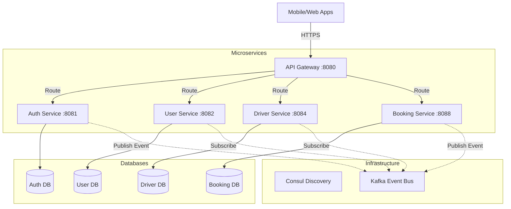
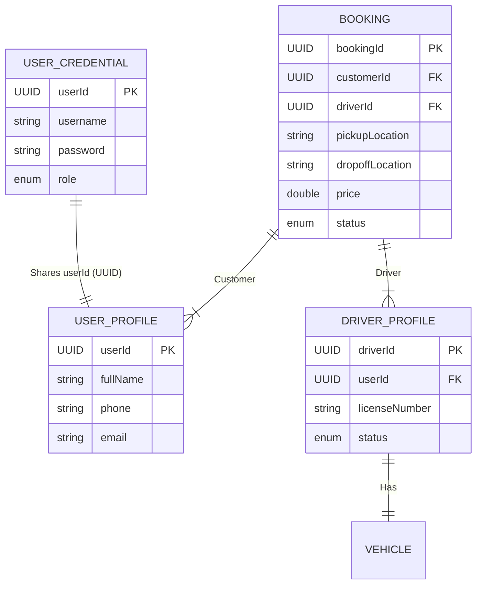
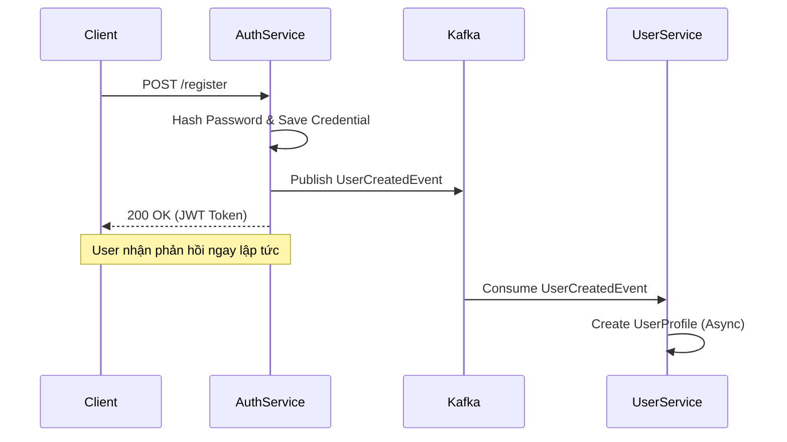
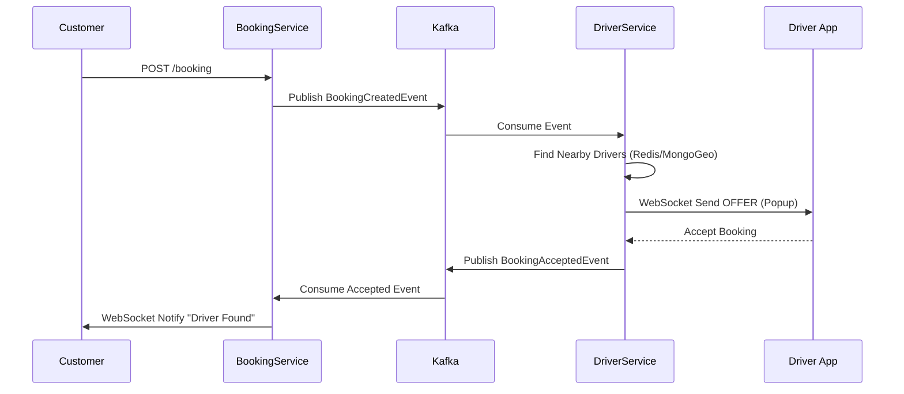
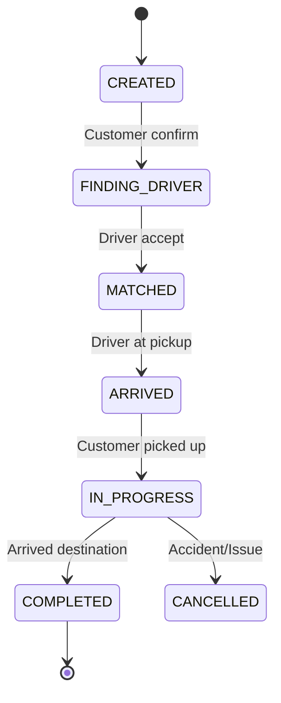
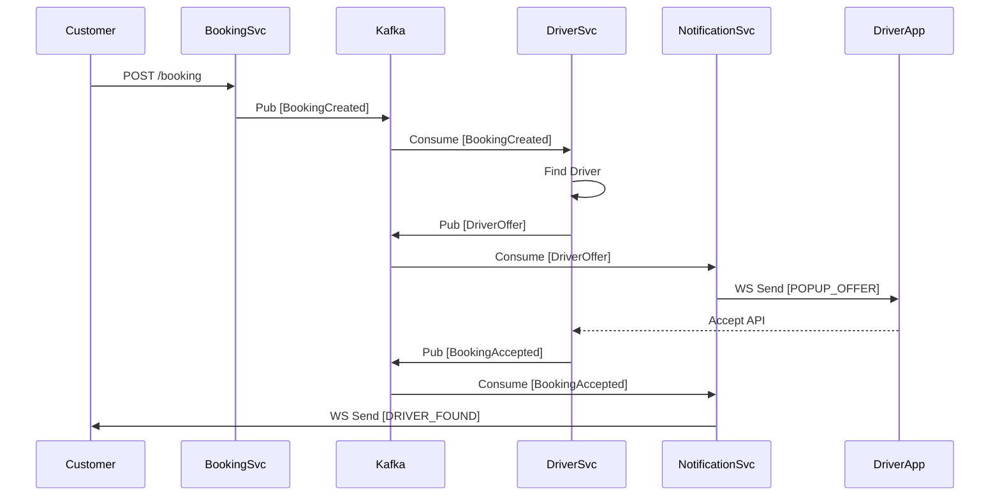

# HƯỚNG DẪN CHI TIẾT & SƠ ĐỒ BÁO CÁO ĐỒ ÁN TỐT NGHIỆP
## Đề tài: Hệ thống Microservices Đặt xe Trực tuyến (GoMirai)

Tài liệu này cung cấp nội dung text, **mã sơ đồ minh họa (Mermaid)** và **kịch bản thuyết trình (Speaker Notes)** cho 25 slide.

---

# PHẦN 1: MỞ ĐẦU (3 Slide)

## Slide 1: Trang tiêu đề
*   **Nội dung:**
    *   **Tiêu đề lớn:** HỆ THỐNG MICROSERVICES ĐẶT XE TRỰC TUYẾN (GOMIRAI)
    *   **Tiêu đề phụ:** Ứng dụng kiến trúc Event-Driven, Saga Pattern và Real-time WebSocket
    *   **Sinh viên thực hiện:** [Tên Sinh Viên] - [MSSV]
    *   **Giảng viên hướng dẫn:** [Tên GVHD]
*   **Kịch bản thuyết trình:** "Xin chào hội đồng và các bạn. Em tên là [Tên], hôm nay em xin trình bày đồ án tốt nghiệp với đề tài xây dựng hệ thống đặt xe GoMirai dựa trên kiến trúc Microservices."

## Slide 2: Nội dung báo cáo (Agenda)
*   **Nội dung:**
    1.  Mở đầu & Lý do chọn đề tài.
    2.  Phân tích bài toán.
    3.  Thiết kế hệ thống (Kiến trúc & CSDL).
    4.  Giải pháp công nghệ cốt lõi.
    5.  Demo & Kết quả thực nghiệm.
*   **Kịch bản:** "Bài báo cáo của em gồm 5 phần chính..."

## Slide 3: Lý do chọn đề tài
*   **Điểm nhấn:** So sánh Monolith vs Microservices trong bài toán đặt xe.
*   **Kịch bản:** "Tại sao lại là Microservices? Với các ứng dụng đặt xe như Grab/Uber, lượng request vào giờ cao điểm là cực lớn. Kiến trúc Monolith cũ bộc lộ điểm yếu khó mở rộng và dễ sập toàn bộ hệ thống. Do đó, em chọn Microservices kết hợp Event-Driven để giải quyết bài toán về hiệu năng và khả năng mở rộng linh hoạt."

---

# PHẦN 2: PHÂN TÍCH HỆ THỐNG (5 Slide)

## Slide 4: Mục tiêu đồ án
*   **Mục tiêu:**
    *   Xây dựng hệ thống Backend chịu tải cao.
    *   Giải quyết bài toán Real-time location tracking.
    *   Đảm bảo tính nhất quán dữ liệu (Data Consistency).
*   **Kịch bản:** "Mục tiêu không chỉ là làm một app đặt xe, mà là xây dựng một nền tảng Backend vững chắc, có khả năng xử lý hàng ngàn giao dịch đồng thời và cập nhật vị trí thời gian thực."

## Slide 5: Đối tượng và Phạm vi
*   **Đối tượng:** Customer, Driver, Admin System.
*   **Phạm vi:** Tập trung sâu vào Core Booking Engine (Đặt xe, Tìm tài xế, Tính tiền). Bỏ qua các phần phụ trợ như Promtion phức tạp hay Chat.

## Slide 6: Công nghệ sử dụng
*   **Hình minh họa:** Logo các công nghệ sắp xếp theo nhóm.
    *   **Core:** Java 21, Spring Boot 3.5.7.
    *   **Infra:** Docker, Consul, Kafka 7.5.
    *   **DB:** MongoDB 7.0.
    *   **Frontend:** ReactJS + Leaflet Map.

## Slide 7: Sơ đồ Use Case tổng quát
*   **Sơ đồ minh họa (Mermaid):**
```mermaid
usecaseDiagram
    actor "Customer" as C
    actor "Driver" as D
    actor "Admin" as A

    package "GoMirai System" {
        usecase "Đăng ký/Đăng nhập" as UC1
        usecase "Đặt chuyến xe" as UC2
        usecase "Xem lịch sử chuyến" as UC3
        usecase "Bật/Tắt nhận chuyến" as UC4
        usecase "Nhận/Từ chối cuốc xe" as UC5
        usecase "Quản lý hồ sơ tài xế" as UC6
    }

    C --> UC1
    C --> UC2
    C --> UC3

    D --> UC1
    D --> UC4
    D --> UC5

    A --> UC6
```
*   **Kịch bản:** "Hệ thống phục vụ 3 nhóm người dùng chính, trong đó Use Case quan trọng nhất là Đặt chuyến xe của Khách hàng và Nhận cuốc xe của Tài xế."

## Slide 8: Đặc tả chức năng trọng tâm (Booking Flow)
*   **Mô tả:** Quy trình từ lúc Khách ấn nút "Đặt xe" -> Hệ thống quét tìm tài xế bán kính 2km -> Gửi thông báo -> Tài xế nhận -> Tạo chuyến đi.

---

# PHẦN 3: THIẾT KẾ HỆ THỐNG (8 Slide)

## Slide 9: Kiến trúc hệ thống (Architecture Diagram)
*   **Sơ đồ minh họa (Mermaid):**

*   **Kịch bản:** "Hệ thống sử dụng mô hình Database Per Service. Mọi request đi qua API Gateway. Các service giao tiếp bất đồng bộ qua Kafka Message Broker."

## Slide 10: Sơ đồ thực thể (ERD) - Logic Collections
*   **Sơ đồ minh họa (Mermaid):**


## Slide 11: Sơ đồ lớp (Class Diagram)
*   **Nội dung:** Show cấu trúc của `gomirai-common-lib` (Thư viện dùng chung).
*   **Kịch bản:** "Để đảm bảo Clean Code và tránh lặp lại logic, em xây dựng một thư viện Common Lib chứa các DTO và Security Config dùng chung cho tất cả các service."

## Slide 12: Sequence Diagram 1 - Đăng ký (Event-Driven)
*   **Sơ đồ minh họa (Mermaid):**

*   **Kịch bản:** "Ở đây em áp dụng Event-Driven. Khi User đăng ký, AuthService trả về thành công ngay lập tức mà không cần chờ UserService tạo hồ sơ xong, giúp giảm độ trễ (Latency)."

## Slide 13: Sequence Diagram 2 - Real-time Booking
*   **Sơ đồ minh họa (Mermaid):**

*   **Kịch bản:** "Luồng phức tạp nhất là Real-time Booking. Em sử dụng WebSocket kết nối trực tiếp driver với DriverService để tối ưu tốc độ gửi Offer."

## Slide 14: Sơ đồ trạng thái (State Diagram) - Chuyến xe
*   **Sơ đồ minh họa (Mermaid):**


## Slide 15: Thiết kế UI/UX - Customer
*   **Mô tả:** Hình ảnh màn hình đặt xe, hiển thị bản đồ trực quan, input điểm đi/đến rõ ràng.

## Slide 16: Thiết kế UI/UX - Driver & Admin
*   **Mô tả:** Màn hình Driver tối giản để dễ thao tác khi lái xe (Nút nhận chuyến to, rõ). Dashboard Admin dạng biểu đồ.

---

# PHẦN 4: HIỆN THỰC HÓA VÀ KỸ THUẬT (4 Slide)

## Slide 17: Cấu trúc Code
*   **Chụp ảnh:** Cây thư mục dự án trong IDE (IntelliJ/VS Code).
*   **Giải thích:** "Dự án được tổ chức theo mô hình Multi-module với `NotificationService` đóng vai trò trung tâm xử lý realtime."

## Slide 18: Kỹ thuật đặc biệt - Centralized Realtime Notification
*   **Chủ đề:** Kiến trúc Centralized Notification Service.
*   **Nội dung:**
    *   Tất cả sự kiện (Booking, Offer, Chat) đều được đẩy vào Kafka.
    *   **Notification Service** là nơi duy nhất quản lý kết nối WebSocket tới Client.
    *   Giúp tách biệt (Decouple) hoàn toàn logic nghiệp vụ khỏi logic gửi thông báo.
*   **Kịch bản:** "Thay vì mỗi service tự quản lý kết nối socket gây phân tán, em xây dựng một Notification Service tập trung. Các service khác chỉ cần bắn event vào Kafka, Notification Service sẽ lắng nghe và đẩy xuống client tương ứng. Kiến trúc này giúp hệ thống dễ dàng mở rộng và bảo trì."

## Slide 19: Sequence Diagram 2 - Real-time Booking Flow
*   **Sơ đồ minh họa (Mermaid):**


## Slide 20: Kiểm thử (Testing)
*   **Chụp ảnh:** Màn hình kết quả chạy Unit Test (Xanh hết) hoặc Postman Collection.

---

# PHẦN 5: KẾT QUẢ VÀ TỔNG KẾT (5 Slide)

## Slide 21: Demo thực tế 1
*   **Video/GIF:** Cảnh User đăng ký và đăng nhập thành công.

## Slide 22: Demo thực tế 2
*   **Video/GIF:** Cảnh realtime: Bên trái (Customer) đặt xe -> Bên phải (Driver) nổ popup -> Driver nhận -> Customer thấy tài xế di chuyển.

## Slide 23: Đánh giá kết quả
*   **Đạt được:** Hệ thống hoàn chỉnh luồng nghiệp vụ chính, chạy ổn định trên Docker.
*   **Hạn chế:** UI chưa quá trau chuốt, chưa có thuật toán ghép xe đi chung (Carpool).

## Slide 24: Hướng phát triển
*   Tối ưu thuật toán tìm đường.
*   Triển khai lên Cloud (AWS/Hệ thống thật).
*   Phát triển App Mobile Native (Flutter/React Native).

## Slide 25: Lời cảm ơn & Q&A
*   Cảm ơn thầy cô và các bạn.

---

# LƯU Ý KHI VẼ SƠ ĐỒ
1.  **Công cụ:** Có thể dùng draw.io, Lucidchart hoặc copy code Mermaid ở trên vào [Mermaid Live Editor](https://mermaid.live/) để generate hình ảnh chất lượng cao.
2.  **Màu sắc sơ đồ:** Nên dùng màu xanh (Blue) cho Service, màu cam (Orange) cho Kafka/Event, màu xám (Grey) cho Database để dễ phân biệt luồng dữ liệu.
