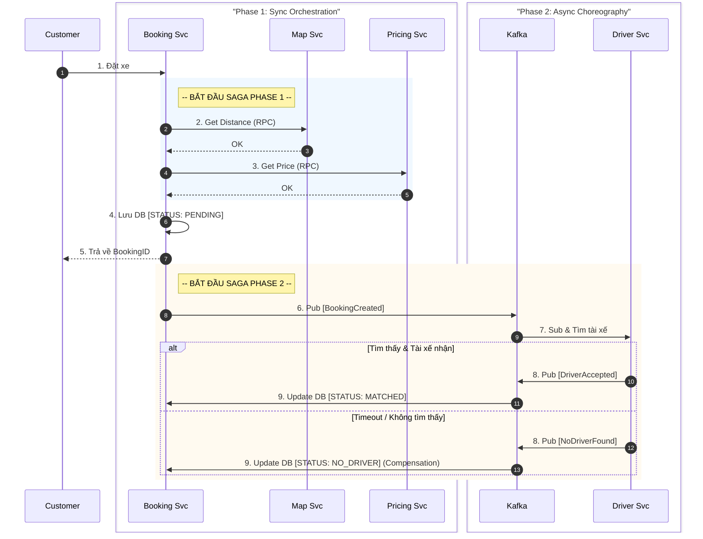

# HƯỚNG DẪN XỬ LÝ SAGA PATTERN TRONG CHỨC NĂNG ĐẶT XE (BOOKING)

Tài liệu này mô tả chi tiết cách áp dụng **Hybird Saga Pattern** (kết hợp Orchestration và Choreography) để giải quyết bài toán giao dịch phân tán trong quy trình Đặt xe của GoMirai.

---

## 1. Vấn đề (Problem)
Trong kiến trúc Microservices, quy trình "Đặt một chuyến xe" không chỉ đơn giản là lưu một bản ghi vào Database. Nó cần dữ liệu và sự phối hợp của nhiều services khác nhau:
1.  **Map Service:** Để tính khoảng cách và thời gian di chuyển.
2.  **Pricing Service:** Để tính giá tiền dựa trên khoảng cách và loại xe.
3.  **Booking Service:** Để lưu trạng thái chuyến đi.
4.  **Driver Service:** Để tìm và gán tài xế.
5.  **Notification Service:** Để thông báo cho khách hàng.

**Thách thức:** Nếu một trong các bước trên thất bại (ví dụ: Tính được khoảng cách nhưng lỗi tính giá), làm sao để đảm bảo dữ liệu không bị sai lệch (Data Consistency)?

---

## 2. Giải pháp: Hybrid Saga Pattern

Hệ thống GoMirai sử dụng mô hình **Hybrid Saga**, chia quy trình thành 2 giai đoạn (Phase) rõ rệt:

### Giai đoạn 1: Orchestration (Khởi tạo & Validate)
*   **Mô hình:** Orchestration (Điều phối tập trung).
*   **Nhạc trưởng (Orchestrator):** `Booking Service`.
*   **Cơ chế:** Đồng bộ (Synchronous) & Fail-Fast.
*   **Mục tiêu:** Đảm bảo đơn hàng được tạo ra là **HỢP LỆ** (có giá, có quãng đường) trước khi lưu vào Database.

### Giai đoạn 2: Choreography (Thực thi & Ghép đôi)
*   **Mô hình:** Choreography (Vũ đạo - Dựa trên sự kiện).
*   **Cơ chế:** Bất đồng bộ (Asynchronous/Event-Driven) qua Kafka.
*   **Mục tiêu:** Tăng tốc độ phản hồi, xử lý việc tìm tài xế (vốn tốn thời gian) dưới background.

---

## 3. Luồng chi tiết (Detailed Flow)

### Phase 1: Orchestration (Tại Booking Service)

Khi API `POST /api/bookings` được gọi:

1.  **Start Transaction:**
    *   `BookingService` bắt đầu xử lý.

2.  **Saga Step 1: Gọi Map Service (Sync)**
    *   *Hành động:* Gửi tọa độ (Pickup, Dropoff) sang `MapService` để lấy `distance` và `duration`.
    *   *Xử lý lỗi (Compensation):* Nếu `MapService` lỗi (timeout/die) -> **HỦY NGAY**. Trả lỗi `MAP_UNAVAILABLE` cho khách. Không lưu gì vào DB.

3.  **Saga Step 2: Gọi Pricing Service (Sync)**
    *   *Hành động:* Gửi `distance`, `vehicleType` sang `PricingService` để lấy `price`.
    *   *Xử lý lỗi (Compensation):* Nếu `PricingService` lỗi -> **HỦY NGAY**. Trả lỗi `PRICING_UNAVAILABLE`.

4.  **Local Commit (Persistence):**
    *   Nếu cả Step 1 và 2 thành công, `BookingService` lưu thông tin chuyến đi vào MongoDB với trạng thái `PENDING` (hoặc `CREATED`).
    *   *Đây là điểm chốt chặn (Checkpoint).*

### Phase 2: Choreography (Event-Driven)

5.  **Publish Event:**
    *   Sau khi lưu DB xong, `BookingService` bắn sự kiện `BookingSearchDriversEvent` vào Kafka topic.

6.  **Saga Step 3: Tìm Tài xế (Async)**
    *   **Tracking Service** (bên Driver) lắng nghe sự kiện từ Kafka.
    *   Thực hiện truy vấn Redis Geo để tìm tài xế gần nhất.
    *   Gửi WebSocket Offer cho tài xế.

7.  **Saga Step 4: Tài xế Chấp nhận**
    *   Tài xế bấm "Nhận chuyến".
    *   `DriverService` bắn sự kiện `DriverAcceptedEvent` vào Kafka.

8.  **Saga End: Cập nhật Trạng thái**
    *   `BookingService` nghe `DriverAcceptedEvent` -> Update trạng thái `MATCHED`.
    *   `NotificationService` báo cho khách hàng "Đã tìm thấy tài xế".

---

## 4. Cơ chế Bù trừ (Compensation Logic)

Mặc dù Phase 1 dùng cơ chế Fail-Fast (lỗi là bỏ), nhưng Phase 2 cần cơ chế bù trừ phức tạp hơn vì Booking đã được lưu vào DB.

| Kịch bản lỗi (Failure Scenario) | Hành động bù trừ (Compensation Action) |
| :--- | :--- |
| **Lỗi Phase 1:** Map/Pricing Service chết | **Atomic Rollback:** Không lưu Booking vào DB. Trả lỗi ngay cho Client. |
| **Lỗi Phase 2:** Không tìm thấy tài xế (Timeout 15p) | **State Update:** Hệ thống tự động chuyển trạng thái Booking từ `PENDING` sang `NO_DRIVER_FOUND` (hoặc `CANCELLED`). Thông báo cho khách hàng đặt lại. |
| **Lỗi Phase 2:** Tài xế từ chối hết | **Retry Logic:** Hệ thống tự động mở rộng bán kính tìm kiếm (Radius Expansion) và thử lại. Nếu vẫn không được -> Áp dụng Timeout Compensation như trên. |

---

## 5. Tại sao lại thiết kế như vậy?

1.  **Tại sao Phase 1 lại Sync (Đồng bộ)?**
    *   Vì Giá tiền và Quãng đường là thông tin **SỐNG CÒN**. Khách hàng cần biết giá ngay lập tức trước khi chốt đặt. Không thể tạo đơn rồi mới tính giá sau (gây rủi ro sai lệch).

2.  **Tại sao Phase 2 lại Async (Bất đồng bộ)?**
    *   Việc tìm tài xế có thể mất từ 10 giây đến vài phút. Nếu giữ kết nối HTTP (Sync), client sẽ bị treo (timeout). Dùng Kafka giúp hệ thống chịu tải cao và client không phải chờ đợi.

---

## 6. Sơ đồ minh họa (Sequence Diagram)

