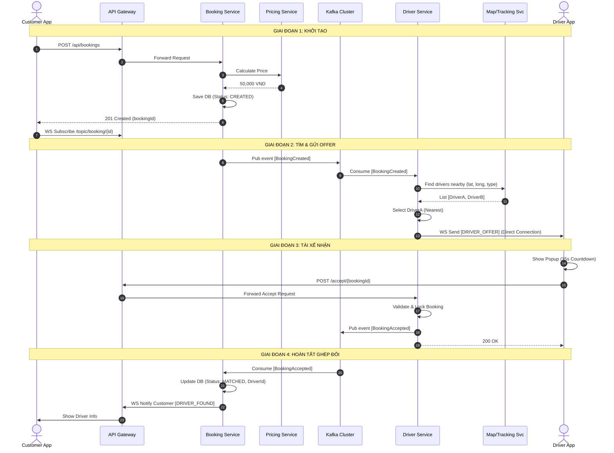
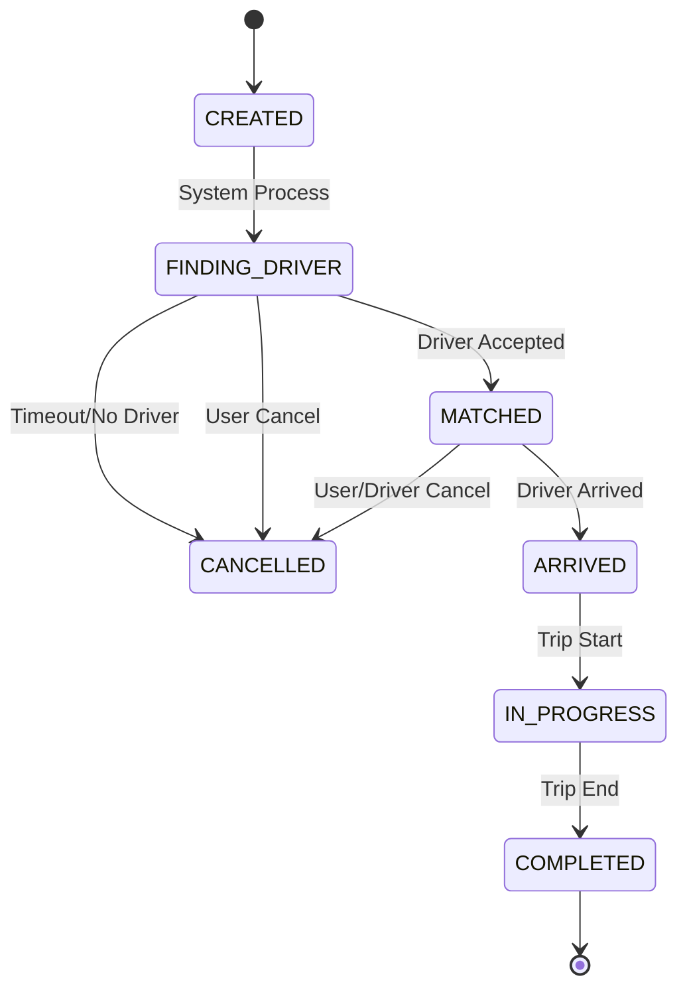

# CHI TIẾT ĐẶC TẢ USE CASE: ĐẶT XE (BOOKING RIDE)

Tài liệu này mô tả chi tiết kỹ thuật và nghiệp vụ cho quy trình cốt lõi nhất của hệ thống GoMirai: **Đặt xe và Điều phối Tài xế**.

---

## 1. TỔNG QUAN

*   **Tên Use Case:** Đặt chuyến xe (Request Booking).
*   **Actor (Tác nhân):**
    *   **Khách hàng (Customer):** Người khởi tạo yêu cầu.
    *   **Tài xế (Driver):** Người nhận yêu cầu.
    *   **Hệ thống (System):** Bao gồm API Gateway, Booking Service, Driver Service, Kafka, WebSocket.
*   **Mục tiêu:** Kết nối thành công Khách hàng với Tài xế phù hợp nhất trong thời gian ngắn nhất.
*   **Trigger (Kích hoạt):** Khách hàng nhấn nút "Đặt xe" trên ứng dụng.

## 2. TIỀN ĐIỀU KIỆN (PRE-CONDITIONS)

1.  **Khách hàng:**
    *   Đã đăng nhập (có JWT Token hợp lệ).
    *   Tài khoản ở trạng thái `ACTIVE`.
    *   Không có chuyến xe nào đang diễn ra (`IN_PROGRESS` hoặc `MATCHED`).
2.  **Tài xế:**
    *   Đã đăng nhập và bật trạng thái sẵn sàng (`ONLINE` & `AVAILABLE`).
    *   Đang gửi tọa độ vị trí (GPS) lên hệ thống (Tracking Service).
3.  **Hệ thống:**
    *   Các service (Booking, Driver, Pricing) hoạt động bình thường.
    *   Kết nối WebSocket của cả Khách và Tài xế đều đang `CONNECTED`.

---

## 3. LUỒNG NGHIỆP VỤ CHÍNH (MAIN SUCCESS SCENARIO)

### Bước 1: Khởi tạo Yêu cầu (Booking Initialization)
1.  **Customer** chọn điểm đón (Pickup) và điểm đến (Dropoff) trên bản đồ.
2.  **Customer App** gọi API tính giá (`GET /api/pricing/calculate`) để hiển thị giá ước tính.
3.  **Customer** nhấn nút **"Đặt xe"**.
4.  **Customer App** gửi request `POST /api/bookings` tới **API Gateway**.
    *   *Payload:* `{ pickup: {lat, lng}, dropoff: {lat, lng}, vehicleType: "CAR_4" }`
5.  **API Gateway** xác thực Token, chuyển request đến **Booking Service**.

### Bước 2: Xử lý Đặt chuyến & Tìm xe (Processing & Matching)
6.  **Booking Service**:
    *   Tạo bản ghi `Booking` trong Database với trạng thái `CREATED`.
    *   Chuyển trạng thái sang `FINDING_DRIVER`.
    *   Lưu thông tin chi tiết vào DB.
7.  **Booking Service** -> **Kafka Producer**:
    *   Publish event: `BookingCreatedEvent` vào topic `booking-events`.
    *   *Payload:* `{ bookingId, customerId, pickupLocation, vehicleType, ... }`
8.  **Customer App**:
    *   Nhận phản hồi 201 Created.
    *   Tự động Subscribe WebSocket từ **Notification Service**: `/user/{customerId}/queue/booking` để chờ kết quả.
    *   Hiển thị màn hình "Đang tìm tài xế...".

### Bước 3: Tìm kiếm & Gửi Offer (Discovery & Offering)
9.  **Driver Service (Kafka Consumer)**:
    *   Nhận `BookingCreatedEvent`.
    *   Truy vấn **Tracking/Map Service** (hoặc Redis Geo) để tìm các tài xế:
        *   Trạng thái: `ONLINE`.
        *   Loại xe: Khớp `vehicleType`.
        *   Bán kính: < 2km (Configurable).
    *   Lấy danh sách tài xế phù hợp.
10. **Driver Service** -> **Kafka Producer**:
    *   Gửi event `DriverOfferEvent` vào topic `driver-offers`.
    *   *Payload:* `{ driverId, bookingId, pickupAddress, ... }`

### Bước 4: Tài xế Nhận Offer & Chấp nhận (Driver Acceptance)
11. **Notification Service (Kafka Consumer)**:
    *   Lắng nghe `DriverOfferEvent`.
    *   Đẩy tin nhắn WebSocket tới Tài xế qua kênh `/user/{driverId}/queue/driver-offers`.
12. **Driver App**:
    *   Kết nối tới `ws://notification-service/ws`.
    *   Nhận tin nhắn, hiển thị **Popup Offer** (Rung + Chuông).
    *   Bắt đầu đếm ngược 15 giây.
13. **Driver** nhấn **"Nhận chuyến" (Accept)**.
14. **Driver App** gọi API `POST /api/drivers/bookings/{bookingId}/accept` (Gửi tới DriverService).
15. **Driver Service**:
    *   Kiểm tra xem Booking này đã có ai nhận chưa? (Race condition check).
    *   Nếu chưa -> Thành công.
    *   Publish `BookingAcceptedEvent` vào Kafka topic `booking-events`.

### Bước 5: Xác nhận & Đồng bộ (Confirmation & Sync)
16. **Booking Service (Kafka Consumer)**:
    *   Nhận `BookingAcceptedEvent`.
    *   Cập nhật trạng thái Booking trong DB: `FINDING_DRIVER` -> `MATCHED`.
    *   Cập nhật thông tin `driverId` vào bản ghi Booking.
    *   Publish `BookingMatchedEvent` (để Notification Service báo cho Customer).
17. **Notification Service (Kafka Consumer)**:
    *   Nhận `BookingMatchedEvent`.
    *   Gửi thông báo tới **Customer** qua `/user/{customerId}/queue/booking`.
    *   *Content:* `{ status: "MATCHED", driverInfo: { name, plate, vehicle, phone } }`.
18. **Customer App**:
    *   Tắt màn hình chờ.
    *   Hiển thị thông tin tài xế và vị trí xe đang di chuyển đến.

---

## 4. CHI TIẾT KỸ THUẬT (TECHNICAL DEEP DIVE)

### 4.1. API Specification

**1. Create Booking (POST)**
*   **Endpoint:** `/api/bookings`
*   **Request Body:**
```json
{
  "pickupLocation": {
    "address": "123 Nguyen Hue, Quan 1",
    "latitude": 10.776,
    "longitude": 106.700
  },
  "dropoffLocation": {
    "address": "Landmark 81, Binh Thanh",
    "latitude": 10.795,
    "longitude": 106.722
  },
  "vehicleType": "CAR_4_SEAT",
  "paymentMethod": "CASH"
}
```

**2. Driver Accept (POST)**
*   **Endpoint:** `/api/drivers/bookings/{bookingId}/accept`
*   **Header:** `Authorization: Bearer <driver_token>`

### 4.2. Kafka Events Structure

**Event: `BookingCreatedEvent`**
Trách nhiệm: Báo cho hệ thống biết cần tìm tài xế.
```json
{
  "eventId": "uuid-gen-123",
  "eventType": "BOOKING_CREATED",
  "timestamp": 1703200000000,
  "payload": {
    "bookingId": "booking-uuid-789",
    "customerId": "cust-uuid-456",
    "coordinates": [106.700, 10.776],
    "radius": 2000,
    "vehicleType": "CAR_4_SEAT"
  }
}
```

**Event: `BookingAcceptedEvent`**
Trách nhiệm: Báo cho BookingService chốt đơn.
```json
{
  "eventType": "BOOKING_ACCEPTED",
  "payload": {
    "bookingId": "booking-uuid-789",
    "driverId": "driver-uuid-999",
    "acceptedAt": 1703200015000
  }
}
```

### 4.3. Biểu đồ Tuần tự Chi tiết (Detailed Sequence Diagram)



---

## 5. CÁC LUỒN NGOẠI LỆ (EXCEPTION FLOWS)

### 5.1. Tài xế từ chối hoặc Hết giờ (Driver Reject / Timeout)
1.  Driver nhấn "Bỏ qua" hoặc hết 15s.
2.  **Driver App** gửi `POST /reject` hoặc **Driver Service** tự detect timeout.
3.  **Driver Service**:
    *   Ghi log tài xế A từ chối.
    *   Chọn tài xế B trong danh sách chờ.
    *   Gửi Offer cho tài xế B.
    *   Lặp lại quy trình.

### 5.2. Không tìm thấy tài xế (No Driver Found)
1.  Sau khi quét hết danh sách hoặc sau 60s không ai nhận.
2.  **Driver Service** publish event `BookingTimeoutEvent`.
3.  **Booking Service** nhận event:
    *   Cập nhật trạng thái `CANCELLED` (Lý do: No Driver).
    *   Gửi WebSocket báo Customer: "Rất tiếc, hiện không có tài xế nào gần bạn".

### 5.3. Race Condition (Tranh chấp)
*   *Tình huống:* Hệ thống gửi offer cho Driver A và Driver B cùng lúc (nếu dùng thuật toán Broadcast thay vì Round-robin). Cả 2 cùng bấm "Nhận".
*   *Xử lý:*
    *   Request của Driver A đến trước -> Lock booking -> Thành công.
    *   Request của Driver B đến sau -> Kiểm tra thấy status != FINDING -> Trả về lỗi "Chuyến xe đã có người khác nhận".

---

## 6. STATE MACHINE DIAGRAM (TRẠNG THÁI BOOKING)

Quy tắc chuyển đổi trạng thái của Booking cực kỳ nghiêm ngặt:

1.  **CREATED**: Mới tạo xong, chưa làm gì.
2.  **FINDING_DRIVER**: Đã bắn Event lên Kafka, đang chờ tài xế.
3.  **MATCHED**: Đã có tài xế + xe.
4.  **ARRIVED**: Tài xế đã đến điểm đón (Driver gửi signal).
5.  **IN_PROGRESS**: Khách đã lên xe, bắt đầu đi (Driver slide "Bắt đầu").
6.  **COMPLETED**: Đã đến đích, thanh toán xong.
7.  **CANCELLED**: Hủy bởi Khách, Tài xế hoặc Hệ thống (Timeout).


